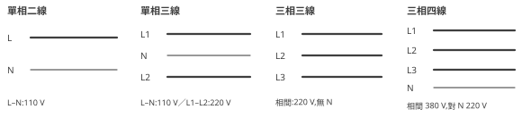

**IEC 60445**

**端子標示與導線識別　設計與配線手冊**

*Basic and safety principles for man-machine interface, marking and identification — Identification of equipment terminals, conductor terminations and conductors*

**機電設計工程師適用｜含導體代號、顏色識別規則與圖面—實物對應指南**

依據 IEC 60445（現行版,已併入舊 IEC 60446 顏色規則）編寫｜81346 系列手冊第七部

2026 年 8 月

**目錄**

**1. 前言**

1.1 本手冊的定位：讓圖與實物對得起來

1.2 沿革：60446 去哪了？

1.3 與 60204-1 的分工

**2. 導體的字母數字識別**

2.1 交流系統

2.2 直流系統

2.3 保護導體與功能導體

**3. 導體的顏色識別**

3.1 兩條鐵律：綠黃與藍

3.2 相線的顏色

3.3 機台配線的顏色慣例（60204-1 加碼）

**4. 設備端子的標示**

4.1 三相設備端子：U、V、W

4.2 端子標示的通則

4.3 元件接點編號的業界慣例

**5. 圖面與實物的對應**

**6. 實務情境範例**

**7. 常見問答（FAQ）**

**8. 常見踩坑總整理**

**附錄 A：導體代號與顏色速查表**

**附錄 B：參考資料**

# 1. 前言

## 1.1 本手冊的定位：讓圖與實物對得起來

先講「導體」這個詞:就是會導電、負責把電送過去的那條線——你手上那把紅的黑的藍的電線,每一條都是一個導體。而「端子」就是線的終點站:元件本體上讓你鎖線、插線的那個接點,像火車站的月台,線是火車,端子是月台編號。

前面幾部手冊解決了不同的問題:第一、二部解決「元件叫什麼」(-QA1 這種參考代號,元件的身分證字號),第四部解決「圖怎麼畫」。但今天你第一次拉開配電盤的門,眼前是一大把導線——問題馬上來了:

- 哪一條是 L1?
- 藍色的一定是中性線嗎?
- 馬達端子上印的 U1、W2 到底是什麼意思?

這些「導體與端子的身分識別」問題,就是 IEC 60445 的守備範圍。

你可以把 60445 想成**圖面與實物之間的翻譯層**:

| 誰在用它 | 用來做什麼 |
|---|---|
| 設計者(畫圖的你) | 決定「這條線上標什麼名字、用什麼顏色」 |
| 配線員 | 把圖上的一條線,正確接到盤裡的位置 |
| 維護人員(半夜被叫來修機的人) | 把手上抓到的一條線,對回圖上的那一條 |

例如圖上寫 -X1:PE 要接綠黃線、-MA1:U1 要接第一相——三方靠同一套規則講話,才不會雞同鴨講。

⚠️ 為什麼這本被 IEC 列為**基礎安全標準(basic safety publication)**、各產品標準都要引用它?因為認錯線的後果很直接:輕則燒設備,重則有人感電。這不是文書作業,是保命規則。

## 1.2 沿革：60446 去哪了？

你翻舊文件、舊教材,常會看到「導線顏色依 IEC 60446」——然後上網一查,咦,這號標準怎麼不見了?

答案很簡單:導體顏色規則原本是獨立的 IEC 60446,==2010 年起 60446 已併入 IEC 60445==——現在「字母數字識別」(L1、N、PE 這些代號)與「顏色識別」(綠黃、藍這些顏色)都收在 60445 一本裡。

💡 實務對策:看到舊文件引用 60446,不用慌,直接查現行 60445 即可,技術內容是延續的。就像公司改了名字,人還是同一批人。

## 1.3 與 60204-1 的分工

60445 不是唯一管顏色的標準,機械領域還有一本 IEC 60204-1(機械電氣設備安全,本系列第五部手冊)。兩本的分工像「中央法規 vs 地方自治條例」:

| 標準 | 管什麼 | 例子 |
|---|---|---|
| IEC 60445 | 通用規則:導體代號怎麼寫、顏色的保留與禁用 | 綠黃雙色只能當 PE;N 用藍色 |
| IEC 60204-1 | 機械領域的加碼要求 | 例外迴路用橘色;控制迴路顏色慣例(第五部手冊) |

記住這個優先順序:通則在 60445,機台的特殊要求在 60204-1;**衝突時,產品標準(60204-1)優先於通用標準**——就像地方自治條例在自己的地盤上說了算。

# 2. 導體的字母數字識別

「字母數字識別」聽起來很硬,白話就是:**每種導體都有標準的名字**。就像家裡每個人都有稱謂——爸爸、媽媽、大哥——你一聽稱謂就知道講誰。導體也一樣:聽到 L1 就知道是第一相,聽到 PE 就知道是保護接地。


## 2.1 交流系統

| 代號 | 導體 | 備註 |
|---|---|---|
| L1、L2、L3 | 三相的第 1、2、3 相 | 系統側(配電)的相線名;L 來自 Line |
| N | 中性線 | 與藍色綁定(3.1 節) |
| 單相:L | 單相的相線 | 家用與控制電源常見 |

⚠️ 一個初學者常混淆的觀念:==相序 L1→L2→L3 是「名字」,不是「顏色」==。什麼意思?

- 換相(調整相序,例如讓馬達反轉)時,你改的是**接線**,不是把線重新命名或重新配色。
- 馬達正反轉出問題時,標準動作是:**圖上看 L 編號、實物看端子印字**,絕對不要看線的顏色用猜的——第 6 章情境二就是有人用猜的,結果馬達倒著轉。

### 2.1.1 同一條相線的不同叫法:R/S/T、U/V/W、A/B/C

台灣現場最容易被搞混的,就是同一條相線在不同年代、不同國家的圖上有不同名字。先把對照表背起來,以後看什麼圖都不慌:

| 體系 | 電源側相線 | 設備/二次側 | 在台灣哪裡會遇到 |
|---|---|---|---|
| **IEC 現行(畫新圖用這套)** | L1、L2、L3 | 端子名 U、V、W | 歐系機台、你自己畫的圖 |
| 舊德規/日規 JIS | R、S、T | U、V、W | 日系機台(三菱、安川)、老師傅口語 |
| 美規 ANSI/NEMA | A、B、C(也用 L1/L2/L3) | T1、T2、T3 | 美系設備、UL 圖面 |

💡 最好的活教材就是**變頻器(INV)的端子台**:日系變頻器輸入端印 R/S/T、輸出端印 U/V/W——一顆元件同時看到兩套叫法。所以老師傅說「R 相沒電」,心裡直接翻譯成「L1 沒電」就對了。

⚠️ 一個重要的身分轉變:==U、V、W 在現行 IEC 裡是「設備端子名」,不是電源相線名==。老日規把二次側「相線」叫 U/V/W,現行標準則把這組字母派給馬達接線盒、變頻器輸出這些「設備門口的端子」(見 4.1 節)。讀舊圖時遇到 U/V/W 標在導線上,要意識到那是老式用法。

🚫 **踩坑**:自己畫新圖還在用 R/S/T 當相線名——驗收時會被挑,跨國專案更會造成混亂。舊叫法只出現在「讀舊圖」的場合,新圖一律 L1/L2/L3。

### 2.1.2 背景知識:單相、三相三線、三相四線是什麼?

代號表裡「單相:L」「L1/L2/L3」「N」的排列組合,其實就對應了台灣常見的幾種供電系統。搞懂這張圖,以後拿到機台規格書寫「3φ3W 220 V」就秒懂:



| 系統 | 組成 | 台灣常見電壓 | 用在哪 |
|---|---|---|---|
| 單相二線(1φ2W) | L+N | 110 V | 一般插座、小家電、控制電源 |
| 單相三線(1φ3W) | L1+L2+N | 110 V／220 V | 台灣住家配電箱的標配:火線對 N 是 110 V,兩條火線之間是 220 V(冷氣、電熱水器) |
| 三相三線(3φ3W) | L1+L2+L3 | 220 V | 台灣工廠動力(大電)最常見,Δ(三角)系統、**沒有 N** |
| 三相四線(3φ4W) | L1+L2+L3+N | 380 V／220 V | 大型廠區與歐規設備:相間 380 V 供動力,相對 N 220 V 供單相負載 |

幾個把觀念串起來的重點:

- ==線電壓(相對相)=相電壓(相對 N)×√3==:220 × 1.732 ≈ 380。這就是「380/220 系統」兩個數字的由來——同一套四線,動力吃 380、單相負載吃 220。
- **三相三線沒有 N**,所以要 110 V 控制電源時取不出來——標準做法是加一顆**控制變壓器**,從 220 V 降到 110 V 或 24 V(這也是為什麼台灣的電控盤裡幾乎都有一顆控制變壓器)。
- 圖框或規格書上的「3φ3W」「1φ3W」就是「三相三線」「單相三線」的縮寫:φ=相(phase)、W=線(wire)。

!!中性線 N 上嚴禁裝設開關或保險絲——單相三線或三相四線系統的 N 一旦斷開,兩側負載變成串聯分壓,輕載側電壓飆高,電器會被過壓燒毀。斷 N 比斷相更危險!!

## 2.2 直流系統

直流系統(最常見的就是盤內 24 V DC 控制電源)也有標準名字:

| 代號 | 導體 | 備註 |
|---|---|---|
| L+ | 正極 | 24 V DC 控制系統的 +24V |
| L− | 負極 | |
| M | 中間點導體 | 例如 ±24 V 系統的 0 V 中點;與藍色綁定 |

💡 「中間點導體 M」是什麼?想像一個系統同時有 +24 V 和 −24 V,中間那個 0 V 參考點就是 M——它在直流世界的角色,類似交流世界的中性線 N,所以顏色規則也一樣綁藍色。

實務上,24 V 控制迴路常直接用**電位名** +24V／0V 標示(第八部手冊的線號主題),與 L+／M 的正式代號並存。兩套都合法,但——

⚠️ 同一個專案內**擇一貫徹**,並在圖例頁宣告。最怕的是同一張圖裡一半寫 L+、一半寫 +24V,新來的維護員會以為是兩種不同的電源。

## 2.3 保護導體與功能導體

這一節出現的都是「接地家族」,但成員的職責天差地遠,先看表:

| 代號 | 導體 | 意義 |
|---|---|---|
| PE | 保護導體(protective earth) | 安全接地——故障電流的回家路 |
| PEN | PE+N 合一導體 | 舊式 TN-C 系統;機台內部原則上不用 |
| PEL／PEM | PE 與 L／M 合一 | 特殊系統,罕見 |
| FE | 功能接地(functional earth) | 為訊號品質、EMC 而接地,**不是**安全接地 |
| FB | 功能等電位連結 | 同上,功能性用途 |

 

先把兩個主角講白:

- **PE(保護導體)**:當設備漏電、外殼帶電時,故障電流沿著 PE 流回去,讓保護裝置跳脫——它存在的唯一目的是**不讓人被電到**。你可以把它想成大樓的逃生梯:平常沒人走,出事時就是命。
- **FE(功能接地)**:為了讓訊號乾淨、減少雜訊干擾(EMC)而接的地,例如示波器量測的參考點、通訊線的屏蔽層。它斷了,人不會怎樣,但訊號會變髒。

⚠️ PE 與 FE 的區分是審圖重點,一句話記住:==PE 顧人身安全,FE 顧訊號品質==。斷了 PE 可能出人命,斷了 FE 只是雜訊變大。

也因為職責不同,顏色規則毫不含糊:!!FE 絕對不得使用綠黃雙色線——綠黃是 PE 的專屬制服,別的導體穿上它就是冒充保命線!!常見作法是 FE 用其他顏色的線,並在圖上明確標 FE。

# 3. 導體的顏色識別

## 3.1 兩條鐵律：綠黃與藍

顏色規則洋洋灑灑,但你要先知道一件事:大部分顏色只是「慣例」,真正**違反就是危險**的只有兩條。這兩條先背死,背到半夜被搖醒也答得出來:

1. !!綠黃雙色＝保護導體(PE)專屬。綠黃線不得作任何其他用途;PE 也不應用其他顏色!!——注意這是**雙向專屬**:綠黃只能是 PE,PE 也只能是綠黃。這是全球通則,沒有例外空間。

2. !!藍色(建議淺藍)＝中性線 N／直流中間點 M。系統裡有 N 時,藍色只給 N!!——迴路中沒有 N 時,藍色線可挪作他用(60204-1 允許,見第五部手冊),但只要 N 存在,藍色就是 N 的。

💡 為什麼綠黃的規則這麼兇?想一個場景:維護員看到一條綠黃線,他的直覺反應是「這是接地線,斷開它不會停機、但可能害死下一個碰外殼的人」。如果有人把綠黃線拿去當 0V 訊號線用,這個直覺就被打破了——每一條綠黃線都變得不可信任。顏色鐵律保護的不是那條線,是**所有人對顏色的信任**。

## 3.2 相線的顏色

相線(L1／L2／L3)的顏色**不是全球統一**——這句話要劃三條線,因為初學者最容易在這裡栽跟頭。

60445 的立場其實很保守:「除綠黃與藍以外的顏色皆可,建議黑、棕、灰」。歐洲固定配線的常見慣例如下:

| 導體 | 常見顏色(歐規慣例) |
|---|---|
| L1 | 棕 |
| L2 | 黑 |
| L3 | 灰 |
| N | 藍 |
| PE | 綠黃雙色 |

⚠️ 但各國電工法規(以及老舊裝置)差異很大:

| 地區/年代 | 相線顏色 |
|---|---|
| 現行歐規慣例 | 棕、黑、灰 |
| 舊歐規 | 曾用黑、黑、黑(三相全黑!) |
| 日本 | 紅、白、黑 |
| 北美 | 另有一套 |

所以:跨國案子**先查目的國法規**;機台內部則以 60204-1 的規則為準(下一節)。

這也帶出 60445 的核心精神,整本手冊最重要的一句話:==**顏色永遠只是輔助,身分以線號與端子標示為準**==。

💡 一個現場故事幫你記住這句話:老師傅接手一台歐洲進口的二手機,盤內電纜芯線是棕黑灰,他習慣的台規顏色卻完全不同。他沒有猜,而是拿出圖,一條一條對線號套管上的數字,兩小時把整盤對完,一條都沒接錯。旁邊的學徒問:「師傅你不是看顏色就知道嗎?」師傅說:「顏色會騙人——不同國家、不同年代、甚至同一捲電纜換批號,顏色都可能不一樣。**線號不會騙人,因為線號是人特地掛上去的身分證。**」

## 3.3 機台配線的顏色慣例（60204-1 加碼）

機台盤內配線,60204-1 在 60445 之上加了一層慣例(詳見第五部手冊,此處速記):

| 顏色 | 用途 |
|---|---|
| 黑 | 交直流動力迴路 |
| 紅 | 交流控制迴路 |
| 藍 | 直流控制迴路 |
| 橘 | 例外迴路——主開關切斷後仍帶電的導線 |
| 綠黃 | PE(鐵律) |
| 淺藍 | N／M(鐵律) |

⚠️ 橘色值得單獨講:所謂「例外迴路」,就是你把主開關拉下來、以為全盤斷電了,它**還活著**的那些線(例如外部供電的照明、跨盤連鎖訊號)。所以——!!橘色＝主開關切斷後仍帶電的例外迴路:看到橘線,先當它有電,量過才准碰!!這是機台領域的保命色。

# 4. 設備端子的標示

導線有名字,線的兩端——設備上的端子——也有標準名字。這章從最常見的三相馬達端子講起。

## 4.1 三相設備端子：U、V、W


三相設備(馬達、變壓器、驅動器輸出)的端子以 U、V、W 標示,對應接入的 L1、L2、L3:

| 端子 | 意義 |
|---|---|
| U1、V1、W1 | 三相繞組的**頭端** |
| U2、V2、W2 | 三相繞組的**尾端** |
| PE(含接地符號) | 保護接地端子 |

先建立一個座標感:==「系統側用 L,設備側用 U」==——圖上一條線從 L1 走到 U1,讀作「電源第 1 相進了設備第 1 端子」。看到 L 開頭,你就知道在講電源那一邊;看到 U/V/W,就知道已經到設備門口了。

### 馬達接線盒裡的六支端子:Y 與 Δ

打開三相馬達的接線盒,你會看到六支端子,**通常刻意排成上下錯位的兩排**:

```text
接線盒端子的常見排列(注意上排是 W2 U2 V2,不是 U2 V2 W2!)

上排:  W2   U2   V2     ← 三個「尾端」
下排:  U1   V1   W1     ← 三個「頭端」,接 L1 L2 L3
```

為什麼上排故意錯位?因為這樣一來,兩種接法都只要放短接片(銅片)就能完成:

**Y 接(星形):把三個尾端短接成一點(星點)**

```text
上排:  W2 ═ U2 ═ V2     ← 一條橫的短接片,三支尾端連成星點
下排:  U1   V1   W1
        │    │    │
       L1   L2   L3
```

**Δ 接(三角形):頭尾交錯相連,上下直短接**

```text
上排:  W2   U2   V2
        ║    ║    ║      ← 三片直的短接片(W2-U1、U2-V1、V2-W1)
下排:  U1   V1   W1
        │    │    │
       L1   L2   L3
```

也就是說:==Y 接＝尾端 U2 V2 W2 全短接成星點;Δ 接＝U1-W2、V1-U2、W1-V2 頭尾交錯兩兩相連==。因為端子排刻意錯位,Δ 接的「交錯」在實物上反而是最單純的「上下直接短接」——這就是那個排列的巧思。

💡 怎麼選 Y 還是 Δ?看馬達銘牌:銘牌會標兩組電壓(相差 √3 倍),**較高的電壓用 Y、較低的用 Δ**。原理白話講:Y 接時每組繞組只分到線電壓的 1/√3,Δ 接時繞組直接吃全額線電壓——所以電源電壓高,就用 Y 讓繞組少吃一點。接錯方向(該 Y 接成 Δ)繞組會過壓過流,馬達燒給你看。

💡 你以後還會遇到「Y-Δ 降壓啟動」:大馬達啟動時先用 Y 接(繞組電壓低、啟動電流小),轉起來後再切換成 Δ 正常運轉——靠接觸器自動切換短接方式,原理就是上面這兩張圖。

看懂了端子名與短接邏輯,接線盒蓋內側那張原廠接線圖,你就再也不會看得一頭霧水了。

## 4.2 端子標示的通則


- 端子標示要**印在端子旁或元件本體上**,而且要持久可辨——用一下就掉的貼紙不算數。標示消失的端子,等於身分不明的線,維護時只能靠猜,而猜就是事故的起點。

- 圖面上的端子代號**必須與實物印字一致**(61082-1 的要求,第四部手冊 2.4 節):圖上寫 A1,元件上就要找得到印著 A1 的那個孔。這條看似廢話,卻是整套「圖物對應」系統的地基。

- 端子排(整排並列的中繼端子)的端子,以「端子排代號:端子號」引用,例如 **-X1:5** 讀作「X1 端子排的第 5 號端子」——冒號前是哪一排,冒號後是第幾格,像「幾巷幾號」的門牌。(端子的系統性識別歸 IEC 61666,見第八部手冊。)

## 4.3 元件接點編號的業界慣例


接觸器、繼電器、按鈕上印的 13-14、21-22 這套數字,嚴格說出自歐洲元件標準(EN 50011／50012 等)的慣例,不在 60445 正文——但它與 60445 的端子標示一起構成「看實物」的完整知識,而且**檢定和面試都超愛考**,整理如下:

| 端子對 | 意義 | 記法邏輯 |
|---|---|---|
| 1-2、3-4、5-6 | 主迴路接點(三相進出) | 單數=進、偶數=出 |
| A1-A2 | 線圈 | A1 接控制電源正/L |
| 13-14、23-24… | 輔助常開接點 | 十位數=第幾組,個位 3-4=常開 |
| 21-22、31-32… | 輔助常閉接點 | 個位 1-2=常閉 |
| 95-96、97-98 | 過載繼電器(台灣現場稱「積熱電驛」TH-RY)的跳脫接點 | 95-96 常閉(跳脫斷開)、97-98 常開 |

核心就是這句:==**判讀口訣:個位數 1-2 常閉、3-4 常開;十位數是流水組號。**==

### 記憶法擴充包

死背容易忘,給你幾套掛勾,挑一套順眼的用:

- **「先閉後開」**:數字小的先出場——1-2(小)是常閉,3-4(大)是常開。平常「閉」著的排前面,要「開」的排後面。
- **門的畫面**:「一、兩(1-2)扇門平常關著(常閉),三、四(3-4)點開門營業(常開)」。
- **十位數是排行,個位數是性格**:13-14 讀作「第 1 組、常開」;21-22 讀作「第 2 組、常閉」。十位數告訴你它是這顆元件的第幾組輔助接點,個位數告訴你它的脾氣(閉或開)。
- **主接點「單進偶出」**:1、3、5 在上面進電,2、4、6 在下面出電——==單數＝進、偶數＝出==,和元件實物上排下排的位置一致。
- **A1-A2 = 線圈的家**:A 想成「Actuator(致動)」或「阿姨(A1)住的家」,總之看到 A1-A2 就是線圈,不是接點。
- **9 字頭 = 保護元件專屬樓層**:過載繼電器的跳脫接點住在 9 樓。個位數延續同一套性格:==95-96 常閉、97-98 常開==——5-6 是 1-2 的親戚(閉),7-8 是 3-4 的親戚(開)。跳脫時 95-96 斷開去停接觸器,97-98 閉合去點警報燈。


圖上接點旁的數字與實物端子印字一一對應——這就是 4.2 節「圖物一致」原則的日常展現:你在圖上看到 -QA2 的 13-14,走到盤前就能在那顆接觸器上找到印著 13 和 14 的兩個孔。

# 5. 圖面與實物的對應

把本手冊與前六部串起來,一條線的完整身分鏈長這樣——就像描述一個人:姓名、住址、身分證字號、長相,層層疊加才鎖定唯一:

| 層次 | 識別 | 出處 |
|---|---|---|
| 這條線接到哪顆元件 | 參考代號 -QA2 | 81346-1／-2 |
| 接到元件的哪個點 | 端子代號 :A1 | 60445+製造商 |
| 線本身叫什麼 | 導體代號/線號(L1、+24V、201…) | 60445+61175(第八部) |
| 線是什麼顏色 | 顏色規則 | 60445+60204-1 |
| 畫在圖的哪裡 | 座標/交互參照 | 61082-1 |

**查線的標準動作**,照做就不會錯:

1. 圖上讀出完整資訊:「-QA2:A1,紅色,線號 105」。
2. 走到盤前,找到參考代號 -QA2 的那顆元件。
3. 在它身上找到印著 A1 的端子。
4. 確認端子上那條線的線號套管印著 105、顏色是紅。

==五個識別全對,才算同一條線==;若顏色對但線號不對——優先相信線號(3.2 節精神:顏色只是輔助)。

💡 現場故事:某廠改機後試車,PLC 一個輸入點永遠不動作。年輕工程師盯著「顏色都對啊」的一把藍線看了一小時;老師傅來了只問一句:「線號呢?」一對線號,發現兩條同色的藍線在端子排上互換了位置——顏色一模一樣,線號 231 和 213 卻對調了。顏色能縮小範圍,**只有線號能定罪**。

# 6. 實務情境範例


**情境一:盤內驗收抓錯。**驗收時發現某條綠黃線一端接 PE 排、另一端卻接到 0V 端子——電工振振有詞:「反正 0V 最後也接地,電位一樣啊。」判定:**不合格**。綠黃是 PE 專屬(3.1 鐵律),0V 是功能導體;即使電位相同,**身分不同**。混用的真正危害在後面:日後維護者看到這條綠黃線,會以為「斷開它不影響機能、只影響安全接地」,結果一拆,0V 浮動、整盤控制亂跳,或者反過來把真正的 PE 當成訊號線拆掉。處置:改用藍色或其他顏色的線,圖面標 M/0V。


**情境二:馬達反轉。**新機台試車,馬達反著轉。查圖:圖面 L1→U1、L2→V1、L3→W1,正確;查盤內:接線正確;最後打開馬達接線盒——V1、W1 兩條線對調了。原因:配線員**憑顏色**接線,而這條電纜的芯線顏色恰好與盤內慣例不同,他看顏色「對號入座」就接錯了。處置:依**端子標示**(不是顏色)改回,並在電纜兩端補掛線號標籤(62491,第八部手冊)。教訓就是 60445 的核心精神:==顏色是輔助,標示才是身分==。


**情境三:老盤改造。**改造 20 年老盤,打開一看:相線全黑、沒有半個線號,活像一鍋黑色義大利麵。依 60445 現行規則整理,順序如下:

| 步驟 | 動作 |
|---|---|
| 1 | 逐線查測、補掛線號標籤 |
| 2 | PE 換綠黃線(或全長套綠黃標識) |
| 3 | 有 N 的迴路,確認藍色沒被挪用 |
| 4 | 例外迴路換橘線並掛警告標示(60204-1) |
| 5 | 產出「新舊線號對照表」——改造案的第一張交付文件 |


**情境四:換一捲線,顏色就變了。**廠內備料的灰色線用完了,採購補了一批,新批號的「灰」偏銀白,和舊線放在一起像兩種顏色。夜班維護員憑印象「銀白色那條是備用線」動手拆線,差點拆到 L3。事後檢討:同一個顏色名稱,不同廠牌、不同批號、甚至曬過幾年太陽之後,看起來都可能不一樣;**顏色是會褪色、會變異的,線號不會**。對策:所有動力線兩端一律掛線號,拆線前對線號,不對印象。

# 7. 常見問答（FAQ）

### Q1:三相一定要棕黑灰嗎?

不是。60445 只**禁止**相線用綠黃與(有 N 系統中的)藍;棕黑灰是「建議+歐洲慣例」,不是強制。機台內部依 60204-1(動力黑、控制紅/藍);固定配線依當地電工法規。一句話:先問「哪裡的規定」,再問「什麼顏色」。

### Q2:藍色線可以拿來當控制線嗎?

看系統:迴路裡**沒有**中性線 N 時可以(60204-1 明文允許,而且直流控制迴路慣用藍色);**有 N** 的部分,藍色保留給 N。同一盤內兩種情形並存時,靠線號區分,並在圖例頁說明——別讓下一個讀圖的人猜。

### Q3:PE 和 FE 最後接在同一支接地棒上,為什麼還要分?

因為「目的」不同,而目的決定了維護時能不能動它:PE 是人身安全,斷了會出人命,受法規強制;FE 是訊號品質,斷了只是雜訊變大。分開標示,維護者才知道**哪條線動不得**。就像逃生梯和景觀樓梯都通到一樓,但逃生梯不准堆東西——用途決定待遇。

### Q4:單相設備的端子怎麼標?

單相用 U1-U2(或製造商標 L-N)。加熱器等無極性負載常直接標 1-2。原則不變:**圖與實物一致**。

### Q5:L1/L2/L3 跟 R/S/T 是什麼關係?

R-S-T 是舊式(德規/日規)相線名,對應現行 L1-L2-L3;二次側舊名 U-V-W 則變成了現行的設備端子名。台灣老師傅口中的「R 相」就是 L1。==看到 R/S/T 的舊圖,直接心譯成 L1/L2/L3==;自己畫新圖不要再用 R/S/T。完整的各國對照表與單相/三相系統背景,見 2.1.1 與 2.1.2 節。

# 8. 常見踩坑總整理

🚫 以下都是現場真實會發生的錯,每一條都有人付過學費:

| 錯誤做法 | 會發生什麼 | 正確做法 |
|---|---|---|
| 綠黃線拿來當 0V/訊號線(「反正也接地」)  | 維護者誤判它是 PE,拆錯線導致 0V 浮動或失去保護接地 | 綠黃只給 PE;0V 用藍或其他色,圖上標 M/0V |
| PE 用綠黃以外的顏色(「庫存只剩黑線」) | 下一個人認不出這是保命線,檢修時當一般線處理 | PE 一律綠黃;真的缺料就全長套綠黃標識 |
| 有 N 的系統把藍線挪作控制線 | 有人把它當中性線量測/接線,判斷全錯 | 有 N 就把藍色留給 N;無 N 系統才可挪用 |
| 憑顏色接馬達線,不看端子印字  | 電纜芯線色與盤內慣例不同→相序接錯→馬達反轉 | 對端子標示(U1/V1/W1)接線,完工掛線號 |
| Y/Δ 短接片照「感覺」放 | 該 Y 接成 Δ,繞組過壓過流,馬達燒毀 | 對照銘牌電壓:高壓 Y、低壓 Δ;照接線盒蓋圖放短接片 |
| 主開關拉下就徒手碰橘色線 | 例外迴路仍帶電,直接感電 | 看到橘線先當它有電,驗電確認後才作業 |
| 把 FE(屏蔽/訊號地)接上綠黃線  | PE 與 FE 混淆,審圖退件;維護時誤動保護導體 | FE 用非綠黃顏色,圖上明確標 FE |
| 圖上寫 A1、實物接到別的端子(「反正線圈兩端沒差」) | 圖物不一致,下次查修對不起來;部分元件 A1/A2 有極性 | 嚴守圖物一致:圖上 A1 就接實物印 A1 的孔 |
| 同專案混用 L+/0V 與 +24V/M 兩套標法且無圖例 | 讀圖者以為是兩種電源,查線繞遠路 | 擇一貫徹,圖例頁宣告 |
| 老盤改造只換線不做新舊線號對照表 | 舊圖全部作廢,下次故障無圖可查 | 對照表是改造案第一張交付文件 |
| 端子標示用普通貼紙,一年就脫落  | 端子身分不明,維護只能拆開猜 | 用持久可辨的印字/雷刻/專用套管 |
| 拆線不掛暫時標籤,「等下就接回去」 | 一通電話過後忘了哪條接哪,亂接試錯 | 拆線先掛標,或拍照+核對線號才復原 |

# 附錄 A：導體代號與顏色速查表

| 代號 | 導體 | 顏色 | 鐵律? |
|---|---|---|---|
| L1／L2／L3 | 交流相線 | 建議棕/黑/灰(機台動力:黑) | 禁綠黃、禁藍(有N時) |
| N | 中性線 | 藍(淺藍) | ★鐵律 |
| PE  | 保護導體 | 綠黃雙色 | ★鐵律(雙向專屬) |
| PEN | PE+N 合一 | 綠黃(端部藍標) | 機台內避免使用 |
| L+/L− | 直流正/負 | 機台控制:藍(60204-1) | |
| M | 直流中間點 | 藍 | |
| FE  | 功能接地 | 不得綠黃 | |
| 例外迴路 | 主開關後仍帶電 | 橘(60204-1) | 機台鐵律 |

| 符號 | 端子標示 | 位置 | 意義 |
|---|---|---|---|
|  | U1 V1 W1／U2 V2 W2 | 三相設備 | 繞組頭/尾端 |
| — | A1-A2 | 線圈 | 控制電源入 |
|  | 1-2/3-4/5-6 | 接觸器主接點 | 單進偶出 |
| — | x3-x4/x1-x2 | 輔助接點 | 個位34常開、12常閉 |
|  | 95-96/97-98 | 過載跳脫接點 | 常閉/常開 |
|  | -X1:5 | 端子排 | X1排第5端子(61666) |

# 附錄 B：參考資料

- IEC 60445, Basic and safety principles for man-machine interface, marking and identification — Identification of equipment terminals, conductor terminations and conductors.

- IEC 60446(已併入 60445,歷史文件).

- IEC 60204-1(機台配線顏色與例外迴路,本系列第五部手冊).

- IEC 61666／IEC 62491(端子與電纜標示,本系列第八部手冊).

- EN 50011／50012 等(元件接點編號慣例).

(本手冊為教學性整理文件;各國電工法規對固定配線顏色另有強制規定,正式設計請以標準原文與當地法規為準。)
