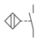

**IEC 61175-1／61666／62491**

**訊號、端子與電纜的標示　線號合輯手冊**

*Designation of signals ／ Identification of terminals within a system ／ Labelling of cables and cores*

**機電設計工程師適用｜三個「連接的名字」標準一次講清楚｜含線號系統設計指引**

依據 IEC 61175-1、IEC 61666、IEC 62491 現行版編寫｜81346 系列手冊第八部

2026 年 8 月

**目錄**

**1. 前言**

1.1 為什麼三個標準合成一冊

1.2 三兄弟的分工：一條線的三個名字

**2. IEC 61666：端子的系統性識別**

2.1 端子排與端子的代號

2.2 端子的完整識別鏈

2.3 端子排規劃的實務原則

2.4 本章常見踩坑

**3. IEC 61175：訊號的命名**

3.1 訊號名與電位名

3.2 命名規則與建議

3.3 訊號名在圖面上的使用

3.4 本章常見踩坑

**4. IEC 62491：電纜與芯線的標示**

4.1 電纜代號

4.2 芯線識別

4.3 標籤的實體要求

4.4 本章常見踩坑

**5. 線號系統的設計（把三者串起來）**

5.1 三種主流線號策略

5.2 同一個迴路,三種編法對照

5.3 選擇策略的建議

5.4 線號規則書

5.5 本章常見踩坑

**6. 實務情境範例**

6.1 情境一：從 PLC 輸入點反查到現場感測器（全冊亮點,step-by-step）

6.2 情境二：兩盤之間的跨盤訊號

6.3 情境三：驗收抽查

6.4 本章常見踩坑

**7. 常見問答（FAQ）**

**附錄 A：標示速查表**

**附錄 B：參考資料**

# 1. 前言

## 1.1 為什麼三個標準合成一冊

先回顧一下你手上已經有什麼。走到這第八部之前,前面的手冊已經給了你兩套名字:

- **81346 給了「物件」名字**:那顆接觸器叫 -QA2,那個端子排叫 -X1——就像每個元件都領到了身分證。
- **60445 給了「導體與端子印字」規則**:接觸器線圈上印 A1/A2、電源側是 L1/L2/L3、綠黃線是 PE——就像元件身上每個接點都有固定的門牌。

那還缺什麼?缺的是**連接本身**的名字。你想想現場實際會問的三個問題:

| 現場會問的問題 | 問的是什麼 | 歸哪個標準管 |
|---|---|---|
| 「這條線套管上的號碼是什麼意思?」 | 訊號/線號 | IEC 61175-1 |
| 「端子排第 5 孔在圖上怎麼寫?」 | 端子的引用 | IEC 61666 |
| 「這捆電纜叫什麼?第 3 芯接哪?」 | 電纜與芯線 | IEC 62491 |

三個小標準各管一段——單獨都不厚,主題又同族(都在講「連接怎麼命名」),所以合為一冊。

💡 這一冊也是「現場感」最重的一冊:線號標籤、端子刻字、電纜吊牌,全是維護者伸手摸得到的東西。前面幾冊講的是文件裡的世界,這一冊講的是文件與實物的接縫。記住一句話:**文件做得再漂亮,線上沒標籤,圖就只是傳說**——沒有人會抱著一疊圖去逐條追線,大家都是看著線上的標籤查圖。

## 1.2 三兄弟的分工：一條線的三個名字

這三個標準的分工,用一個比喻就記得住:**同一條線,其實有三個名字,就像一位快遞員有三種身分資訊**——

- 他**停靠在哪個窗口**(插在哪個端子)→ 端子號,IEC 61666 管;
- 他**送的是什麼訊息**(這條線傳遞什麼資訊)→ 訊號名,IEC 61175-1 管;
- 他**搭的是哪一班車**(這根芯屬於哪捆電纜)→ 電纜與芯線號,IEC 62491 管。

三個名字問的是三件不同的事,缺一不可:只知道窗口不知道訊息,你看得到線卻不懂它在幹嘛;只知道訊息不知道車班,你知道有這個訊號卻找不到實體那根線。

| 標準 | 給什麼東西命名 | 比喻 | 產出的識別 | 實物形式 |
|---|---|---|---|---|
| IEC 61666 | 端子(terminal) | 停靠的窗口 | -X1:5 | 端子排刻字/印字 |
| IEC 61175-1 | 訊號(signal) | 送的訊息 | START_CMD、+24V | 圖上的識別文字、中斷點配對名 |
| IEC 62491 | 電纜與芯線 | 搭的車班/座位 | -W3、芯線1/BK | 線標套管、電纜吊牌 |

==一條線的三個名字:插在哪找 61666、傳什麼找 61175、跟誰同捆找 62491==——後面每一章講一個名字,第 5 章教你把三個名字編成一套系統,第 6 章帶你用這三個名字在現場導航。

⚠️ 三者都不是獨立王國,全都掛在 81346 的代號體系上:端子屬於某個端子排物件(X 類)、電纜本身就是一個物件(W 類)、訊號名與參考代號並用。所以這一冊講的其實是「81346 在連接層的三個應用」——如果你對 X 類、W 類代號還不熟,先回去翻第二部手冊。

# 2. IEC 61666：端子的系統性識別

先講第一個名字:窗口。


**端子(terminal)**是什麼?就是線的「轉運站」——盤內配線與盤外電纜不會直接焊在一起,而是各自壓進端子排的同一個孔位,靠端子導通。**端子排(terminal block/strip)**則是一整排端子鎖在導軌上的組合,像郵局的一整排窗口。台灣現場都叫它「**端子台**」——聽到「拉到端子台」就是指這排東西。

## 2.1 端子排與端子的代號

- 端子排是一個物件,依 81346-2 用 **X** 類代號:-X1(動力端子排)、-X2(控制)、-X10(閥島)…就像每一排窗口有自己的櫃檯編號。

- 排上的單一端子以冒號接端子號:**-X1:5**＝X1 排第 5 端子。==冒號前是端子排、冒號後是端子號:-X1:5 就是 X1 排的第 5 孔==。這個冒號語法不是這裡發明的,而是 81346-1 的端子記法(第一部手冊 4.2 節)——跟 -QA2:A1(QA2 的 A1 端子)是同一套文法。

- 端子號建議用純數字流水,實物依序刻印;特殊端子(PE、N)用字母標示,與 60445 一致。也就是說,你在端子排上會看到「1、2、3…PE、N」,而不是「壹、貳、參」或自創符號。

## 2.2 端子的完整識別鏈

一個端子在文件中的完整身分(由外而內),就像地址從國家寫到門牌:

**=G1+A1-X1:5** ＝ 功能 G1、位於 A1 盤、X1 端子排、第 5 端子

實務上你在圖面上很少看到寫這麼長——依省略規則(第一部手冊 7.2 節),圖面通常只標 -X1:5,高階代號(=G1+A1)由圖框宣告,就像同一個城市裡寄信不用寫國名。

💡 **端子圖(61355 分類 &EMA)**是端子專屬的文件,逐端子列出:

| 欄位 | 內容 | 例 |
|---|---|---|
| 左側:內部配線 | 接往盤內哪個元件哪個端子 | -QA2:A1 |
| 中間:端子本身 | 端子排:端子號 | -X1:5 |
| 右側:外部配線 | 接往哪條電纜哪根芯線 | -W3:2 |

為什麼端子圖這麼重要?因為**端子排是盤內與盤外的邊界**——盤內是設計者的世界,盤外是現場的世界,端子圖就是這個邊界的「海關名冊」:每一條要過境的線,進出都登記在案。

## 2.3 端子排規劃的實務原則

設計端子排不是把線隨便塞滿就好,幾條實務原則:

- **分排原則**:動力/控制/安全迴路/特低電壓分排;不同電壓等級不混排,或以隔板+標示分段。理由很直白——維護的人拆 24V 控制線時,不該冒著摸到 380V 的風險。

- **編號留白**:端子號預留備用(每功能段留 10–20%),避免改機時出現 5a、5b 這種補丁號。就像新大樓門牌先跳號,以後加蓋才不用出現「5 號之 1 之 2」。

- **橋接標示**:**短接片(jumper)**是把相鄰端子用金屬片橋起來讓它們電氣相通的小零件,常用來把多個端子併成同一電位。短接片必須畫進端子圖——==實物上看不出來的電氣連接,是查線最大陷阱==:你看兩個端子各接各的線,以為互不相干,其實背後被短接片悄悄連在一起。


- **一孔一線**:!!一個端子孔只壓一條線;要並聯就用橋接片,不准塞兩條線!!(這也是多數端子製造商與驗收規範的要求)。兩條線塞一孔,壓接不牢、易鬆脫發熱,而且拆其中一條時另一條會跟著鬆。

## 2.4 本章常見踩坑

🚫 常見踩坑:

| 錯誤做法 | 會發生什麼 | 正確做法 |
|---|---|---|
| 端子號排好排滿,不留備用 | 改機加點時只能補 5a、5b,端子排順序大亂,查線的人數孔數到懷疑人生 | 每功能段預留 10–20% 備用端子號(2.3 節) |
| 現場加了短接片,端子圖沒畫  | 查線的人量到兩個「不相干」端子相通,誤判線路短路,白查半天 | 任何橋接一律畫進端子圖,改橋接視同改圖 |
| 動力與控制、不同電壓混在同一排 | 拆控制線時誤觸動力端子;誤把 220V 接進 24V 迴路燒設備 | 分排,或隔板+電壓標示分段(2.3 節) |
| 一孔硬塞兩條線省端子  | 壓接不牢發熱、拆一條鬆兩條,驗收直接被打槍 | 一孔一線,並聯用橋接片 |

# 3. IEC 61175：訊號的命名

第二個名字:訊息。這一章講的東西摸不到——訊號(signal)是「線上傳遞的那份資訊」,不是銅線本身。61175-1 管「訊號指定」(designation of signals):給每一個資訊流一個唯一的名字。

## 3.1 訊號名與電位名

圖面上你會看到兩種常見形態的「線上文字」,初學者最容易混淆,先分清楚:

- **電位名(potential)**:L1、L2、L3、N、PE、+24V、0V——描述「這條網路是什麼電位」。全圖同名即同電位:圖上任何地方寫 +24V 的線,電氣上都是同一張網。它是中斷點配對的背景層(第四部手冊 5.2 節)。

- **訊號名(signal)**:START_CMD、ESTOP_CH1、SPEED_REF——描述「這條線傳遞什麼資訊」,是控制邏輯的名字。

差別在關心的事:==電位名關心「電從哪來」,訊號名關心「訊息說什麼」==。打個比方:電位名像水管標「自來水/熱水」,訊號名像對講機標「這一路是警衛室呼叫」。動力迴路標電位名,控制與通訊迴路標訊號名,同一條線可以兩者都有——一條 24V 的啟動指令線,電位上屬於 +24V 網,邏輯上叫 START_CMD,不衝突。

## 3.2 命名規則與建議

61175 要求訊號名在其適用範圍內**唯一、穩定、可解讀**——唯一是不撞名,穩定是不隨便改,可解讀是別人看得懂。實務建議規則(寫進專案線號規則書,5.4 節):

- **結構化命名**:〔來源/功能〕_〔動作〕_〔屬性〕,如 CONV1_RUN_FB(輸送機1_運轉_回授)。三段式讓名字自己會說話:誰的、做什麼、哪一類。

- **字元紀律**:只用大寫字母、數字與底線;不用空格與特殊字元。理由不是美觀——是 CAD 與 PLC 變數的相容性,很多 PLC 根本不吃空格和中文變數名。

- **與 PLC 變數名對齊**:==圖上的訊號名＝程式裡的變數名==。這條做到了,除錯時圖與程式一句話對上:「CONV1_RUN_FB 沒回來」,電氣員跟程式員講的是同一個東西;做不到,兩邊各講各的黑話,翻譯就是浪費的工時。

- **安全訊號加識別字首**(如 ES_、SF_):審圖時一眼掃出安全鏈,不會把急停訊號當一般 I/O 隨手改掉。

## 3.3 訊號名在圖面上的使用

訊號名不是取好放著,它在三個地方工作:

- **中斷點配對**:跨頁的線靠成對箭頭+「同名」配對,訊號名就是那個名(第四部手冊 5.2 節)。名字取得爛,跨頁就接錯。

- **I/O 清單(61355 的 &EFP,FP=訊號描述類)**:每個 I/O 點一行——訊號名、PLC 位址、端子、電纜芯線。這張表是電氣圖與 PLC 程式的對照表,也是第 6 章反查情境的起點。

- **匯流排訊號**:通訊線標網路名(如 PROFINET_1)就好,節點細節留給網路圖——匯流排上跑幾百個變數,不可能全寫在線上。

## 3.4 本章常見踩坑

🚫 常見踩坑:

| 錯誤做法 | 會發生什麼 | 正確做法 |
|---|---|---|
| 訊號名用空格、中文、特殊字元(如「馬達1 啟動!」) | 匯入 PLC 變數表直接報錯,或被軟體自動改名,圖與程式從此對不上 | 大寫+數字+底線,規則寫進規則書(3.2 節) |
| 圖上叫 START_CMD,PLC 裡叫 M_Start_1 | 除錯時電氣員與程式員雞同鴨講,查一個訊號要先「翻譯」 | 圖上訊號名＝PLC 變數名,一開案就對齊 |
| 安全訊號取名跟一般 I/O 長一樣 | 改圖時把急停鏈當普通輸入改接,安全功能被不知不覺破壞 | 安全訊號加 ES_/SF_ 字首,審圖專門掃一輪 |

# 4. IEC 62491：電纜與芯線的標示

第三個名字:車班與座位。**電纜(cable)**是多根芯線包在同一層外皮裡的「成纜」製品;**芯線(core)**是電纜裡的單根導線。62491 管的就是這兩層的標示。


## 4.1 電纜代號

- 電纜是物件,依 81346-2 用 **W** 類:-W1、-W2…。注意範圍:==盤內單芯跳線不編 W;「成纜」的多芯電纜、動力電纜、通訊纜才編 W==。盤內幾百條跳線每條都編 W,清單會被淹沒,真正需要管理的跨區電纜反而找不到。

- **電纜清單**(61355 的 &EMB/連接文件類)逐纜列出:代號、型式規格、芯數線徑、起點終點、長度、敷設路徑。起點終點用參考代號寫(如 從 +A1-X1 到 +M1-MA1)——這樣清單自己就能跟 81346 的位置體系對上,不用另外寫「從電氣室到三樓輸送機」這種口語地址。

## 4.2 芯線識別

多芯電纜的單根芯線,兩種識別方式(依電纜製品而定,買來是哪種就用哪種):

| 方式 | 引用寫法 | 例 |
|---|---|---|
| 數字芯(芯上印 1、2、3…) | -W3:1、-W3:2 | 控制電纜常見 |
| 顏色芯(靠絕緣皮顏色分) | 以色碼縮寫引用 | BK(黑)、BN(棕)、BU(藍)、GNYE(綠黃) |

- ==色碼縮寫一律用 IEC 60757 標準代號,圖面不寫中文顏色==:BK/BN/RD/OG/YE/GN/BU/VT/GY/WH/GNYE(黑/棕/紅/橙/黃/綠/藍/紫/灰/白/綠黃)。寫「棕」還是「咖啡色」?寫 BN 就沒有這個問題,而且圖面與端子圖統一。

- !!綠黃芯(GNYE)只能作 PE,任何情況都不得移作他用!!——這是 60445 鐵律延伸到電纜芯(第七部手冊 3.1 節)。哪怕電纜芯數不夠、綠黃芯「閒著很浪費」,也不能拿來當訊號線:下一個維護的人看到綠黃就會當保護導體處理,你埋的是感電事故的引信。

## 4.3 標籤的實體要求

62491 不只管「取什麼名」,還管「標籤本身要做到什麼」。驗收時逐條檢查:

- ==**兩端都標**:每條電纜、每根芯線在兩個端接點都要有標示——只標一端,拆過一次就失憶。==想像你拆下十根芯做保養,沒標籤的那端現在是十根裸線,你要靠通測儀一根一根認回去。

- **可辨識、耐久**:標籤在安裝狀態下可讀(方向、位置要對——標籤轉到背面等於沒標),耐現場環境(油、UV、溫度);💡 套管(熱縮或穿入式號碼管)優於貼紙,貼紙在油污環境撐不過一年。

- **與文件一致**:==標籤內容＝圖面代號,寫錯等於沒標==。標籤寫 -W3:5、圖上寫別的,查線的人拿著標籤查不到圖,比沒有標籤更誤導。

- **改線改標**:!!改機三同步:先改圖、再改線、同步改標——三者不同步的線,就是留給下一個人的地雷!!舊機台查線災難,九成都是「線改了圖沒改」或「圖改了標籤還是舊的」的歷史欠帳。

## 4.4 本章常見踩坑

🚫 常見踩坑:

| 錯誤做法 | 會發生什麼 | 正確做法 |
|---|---|---|
| 電纜只在盤端標,現場端不標 | 現場端拆線後認不回去,只能兩人拿通測儀對線,一條纜耗掉半天 | 兩端都標,芯線也是(4.3 節) |
| 油污/戶外環境用貼紙標籤 | 半年後標籤捲邊、字糊、脫落,整區標示歸零 | 用套管或耐候標籤,選材寫進規則書 |
| 綠黃芯芯數不夠時「借」來當訊號線  | 後人把它當 PE 處理——量測誤判、接地混亂,最壞是感電事故 | GNYE 永遠只作 PE;芯數不夠就換電纜(4.2 節) |
| 標籤裝好後被紮線帶蓋住、或字朝牆 | 驗收讀不到、維護讀不到,等於沒標 | 「安裝狀態下可讀」列入自主檢查(4.3 節) |

# 5. 線號系統的設計（把三者串起來）

前三章給了三個名字,這一章回答一個實務問題:**每段導線上套的那個號碼管——「線號」——到底該編什麼?**標準沒有硬性規定單一作法,這是專案層級的設計決策,但業界收斂成三種主流策略。

## 5.1 三種主流線號策略

| 策略 | 線號內容 | 優點 | 代價 |
|---|---|---|---|
| 等電位編號 | 同電位的所有線段同號(如 105 號網路) | 查訊號極快:==等電位編號的口訣:同號即相通== | 改迴路時網路要重編 |
| 目的地編號 | 每段線標「對端位置」(如 -QA2:A1) | 不用查圖就知道這條線去哪 | 標籤長;同一條線兩端標示不同 |
| 頁欄流水號 | 線號＝頁+欄+流水(如 8.6-1) | 與圖面座標直接對應,拿線號翻圖秒到 | 線移頁就要改號 |

白話翻譯一下三種思路:

- **等電位編號**:把「電氣上相通的一整張網」當一個單位,整張網一個號。像捷運同一條線,不管你在哪一站看到,都叫紅線。
- **目的地編號**:每段線標「我的另一頭在哪」。像行李吊牌寫目的地機場。
- **頁欄流水號**:線號就是「這條線畫在圖的哪裡」。像書的頁碼加行號。

## 5.2 同一個迴路,三種編法對照

光看定義還是抽象,拿同一個迴路來編三次你就懂了。迴路:啟動按鈕 -SF1 的 a 接點(13-14)串到接觸器 -QA2 的線圈 A1,這段線畫在圖第 8 頁第 6 欄,是本頁第 1 條新線。

| 策略 | 這段線(-SF1:14 → -QA2:A1)的線號 | 你在現場看到它時,能直接知道什麼 |
|---|---|---|
| 等電位編號 | 兩端同套 **105**(此電位網編為 105) | 「盤內所有套 105 的線都跟它相通」——量測時同號必導通 |
| 目的地編號 | -SF1 端套 **-QA2:A1**;-QA2 端套 **-SF1:14** | 「這條線的另一頭在哪」——不用開圖就能追線 |
| 頁欄流水號 | 兩端同套 **8.6-1**(第 8 頁第 6 欄第 1 條) | 「這條線畫在圖的哪一頁哪一欄」——拿著線號直接翻圖 |

⚠️ 注意目的地編號的特性:同一條線兩端的標籤**內容不同**(各標對方),做標籤與驗收核對時要特別小心方向,別把兩端印反。

### 手把手:第一次幫迴路編線號(等電位法)

很多人看完策略還是不知道從哪下手,其實只要背兩條規則,任何迴路都編得出來:

1. ==同一電位=同一線號:電氣上直接相通(中間沒有隔任何元件)的所有線段,通通同一個號==。
2. ==過了「元件」就換號、過了「端子台」不換號==——接點、線圈、保險絲、開關會把電位隔開,所以跨過去要給新號;端子台只是線的中繼月台,電位沒變,號碼跟著過去。

拿最經典的啟動/停止自保持迴路實際編一次:


| 步驟 | 動作 | 結果 |
|---|---|---|
| ① | 先編兩條電源軌:控制電源出來的那條給 **1**,回去的那條給 **0** | 電源側定錨,之後都從這裡長出去 |
| ② | 從 1 出發,過了停止鈕 -SF2(第一個元件)→ 換號 | 停止鈕之後的線=**2** |
| ③ | 過了啟動鈕 -SF1 → 再換號 | 啟動鈕之後、線圈之前=**3** |
| ④ | 自保接點 -QA2 與啟動鈕**並聯**:兩端各自跟啟動鈕同電位 | 兩端直接沿用 **2** 與 **3**,不給新號 |
| ⑤ | 過了線圈 A1-A2 → 回到電源軌 | 線圈之後=**0**,收工 |

💡 檢查方法很直觀:拿三用電表量,==同號的線不管在盤內哪個角落,必定導通==;量到同號不通、異號相通,就是有地方接錯了。

⚠️ 最容易犯的錯就是第 ④ 步和端子台:並聯支路以為要給新號(不用——兩端電位跟人家一樣),線過端子台 -X1 以為要換號(也不用——端子不隔電位)。記住:**看電位,不是看線段數**。

### 動力迴路與號段規劃

動力迴路(大電)台灣常見的編法是「相名+級數」:每過一級設備,前面加一個數字:

```text
L1 ──[NFB -QA1]── 1L1 ──[MC -QA2]── 2L1 ──[TH-RY -BB1]── U(馬達端子)
L2 ──[NFB -QA1]── 1L2 ──[MC -QA2]── 2L2 ──[TH-RY -BB1]── V
L3 ──[NFB -QA1]── 1L3 ──[MC -QA2]── 2L3 ──[TH-RY -BB1]── W
```

看到 2L1 就知道:「這是 L1 相、已經過了兩級設備」——維修時判斷「電到哪一級」特別好用。

控制迴路的號碼則常用**號段規劃**,讓人看號碼就知道迴路種類:

| 號段(範例) | 用途 |
|---|---|
| 1~99 | AC 控制迴路(控制變壓器二次側) |
| 101~199 | DC 24 V 控制迴路 |
| 201~299 | 類比/感測訊號 |
| 301~ | 跨盤/通訊相關 |

⚠️ 號段怎麼切**沒有標準答案**,每家公司不同——重點是切好之後寫進**線號規則書**(5.4 節),全案貫徹。看到別人的圖,先翻他的規則書,不要拿自己公司的號段去猜。

## 5.3 選擇策略的建議

- 機台控制盤(本系列的主場景)最常用**等電位編號**,搭配 CAD 自動編號;動力迴路可簡化為電位名(L1/L2/L3 貫穿全圖不另編號)。

- 通訊/安全迴路建議在等電位號之外加掛**訊號名**(3.2 節),雙標示——線號給配線的人,訊號名給看邏輯的人。

- 沒有絕對優劣,==**全案一致**比選哪種重要==;三種都能用的前提是「整案只用一種主策略」。選定後寫進線號規則書。

## 5.4 線號規則書

每個專案應有一頁「線號規則書」(放圖例頁或設計規範,61355 分類 &AD 類),至少載明:

| 項目 | 內容 |
|---|---|
| 線號策略與格式 | 用哪一種策略(5.1 節)、號碼格式 |
| 電位名清單 | L1/L2/L3/N/PE/+24V/0V… |
| 訊號名命名規則 | 結構、字元、字首(3.2 節) |
| 電纜代號規則 | W 號範圍、哪些線編 W(4.1 節) |
| 色碼縮寫表 | IEC 60757 縮寫(4.2 節) |
| 標籤材質與位置要求 | 套管/吊牌、兩端標(4.3 節) |

💡 有這一頁,新進人員十分鐘接手線號系統;沒有這一頁,每個人各編各的,一年後這個案子的線號就是一部沒人看得懂的方言史。

## 5.5 本章常見踩坑

🚫 常見踩坑:

| 錯誤做法 | 會發生什麼 | 正確做法 |
|---|---|---|
| 一個案子混用兩三種線號策略(前盤等電位、後盤頁欄號) | 查線的人每換一個盤要換一套腦袋,誤判「同號相通」規則 | 全案一種主策略,寫進規則書(5.3 節) |
| 改機加線時「借用」已刪除迴路的舊線號 | 舊號在別頁悄悄復活,查線的人以為兩處相通,誤判到懷疑儀器壞掉 | 新號依規則書往下編;舊號要重用,先全圖確認已清乾淨 |
| 不寫線號規則書,「規則在老王腦袋裡」 | 老王休假/離職,線號系統瞬間變成解不開的密碼 | 一頁規則書放圖例頁,隨圖發行(5.4 節) |

# 6. 實務情境範例

前面五章的三個名字與線號系統,現在拿到現場用一遍。

## 6.1 情境一：從 PLC 輸入點反查到現場感測器（全冊亮點,step-by-step）

**狀況**:操作畫面報「輸送機 1 定位異常」,你查 PLC 發現輸入點 I2.3 沒有訊號。感測器在幾十公尺外的現場,你要從程式裡的一個位址,一路走到現場那顆感測器。這趟導航,每一步都踩在本冊教的標示上:

**步驟 1|從 PLC 位址查 I/O 清單(3.3 節)**
打開 I/O 清單,找到 I2.3 那一行,讀到四個關鍵欄位:

| 欄位 | 內容 | 這是誰給的名字 |
|---|---|---|
| 訊號名 | CONV1_POS_FB(輸送機1_定位_回授) | 61175(訊息) |
| 端子 | -X2:14 | 61666(窗口) |
| 電纜芯線 | -W12:3 | 62491(車班座位) |
| 現場元件 | -BG7(接近開關) | 81346(身分證) |

一行表格,三個名字加一張身分證,整條導航路線已經在手上了。

**步驟 2|翻端子圖,確認 -X2:14 的兩側(2.2 節)**
端子圖(&EMA)上找到 -X2:14 這一行:左側(內部)接往 PLC 輸入模組的哪個點、右側(外部)接 -W12 芯 3,有沒有橋接短接片也看這裡——先看圖,才知道等一下在盤內該量哪裡、該不該有跨接。

**步驟 3|開盤,在端子排上找到刻字 14 的端子**


-X2 排的刻字依序數到 14(2.1 節:實物刻字=圖面端子號,所以你不用數線,只要認字)。在這裡先做第一次量測:內側對 0V 量電壓,分辨問題在盤內側還是現場側。

**步驟 4|認出外部側的線標(4.3 節)**
-X2:14 外部側那根芯,套管上印著 -W12:3——標籤內容=圖面代號,所以你可以放心確認「這就是清單上那根芯」,不是靠猜。

**步驟 5|順著電纜吊牌走到現場(4.1 節)**
出盤的電纜束裡找到吊牌 -W12 的那條纜,沿線槽走到現場端——電纜兩端都有吊牌(兩端都標),所以走到另一頭還能再核對一次。

**步驟 6|抵達現場元件 -BG7**
電纜另一端接進接近開關 -BG7 的接線盒。現場元件銘牌 -BG7 = 圖面代號 = I/O 清單上那一格,身分對上,開始查感測器本體:供電有沒有到、感應距離、指示燈狀態。



**步驟 7|(如果要往回走)反向也通**
今天如果是現場先發現 -BG7 壞了,同一條鏈反著走:元件代號 → 電纜吊牌 → 芯線標 → 端子號 → I/O 清單 → PLC 位址,一樣一步不斷。

💡 這個情境的重點不是步驟多,而是:==訊號名→端子號→電纜芯號→元件代號,四個標示搭成一條完整導航鏈==,而且**每一步都有實物標籤可對**——你從頭到尾沒有用三用電表「猜」過任何一條線是誰。標示系統省下的,就是這些猜的時間。

## 6.2 情境二：兩盤之間的跨盤訊號


+A1 盤送急停鏈訊號到 +A2 盤。同一條線,三個名字在三份文件各出現一次:

| 文件 | 呈現方式 | 用到的名字 |
|---|---|---|
| 電路圖 | 中斷點成對箭頭掛訊號名 ES_CHAIN_1 | 訊號名(61175) |
| 兩盤端子圖 | -A1 側 -X5:1、-A2 側 -X1:21 各一行 | 端子號(61666) |
| 電纜清單 | -W20:「從 +A1-X5 到 +A2-X1,4×0.75,芯1=ES_CHAIN_1」 | 電纜與芯線(62491) |

三份文件三個視角,靠訊號名與電纜代號鎖在一起——這就是 1.2 節「一條線的三個名字」在同一條線上的合體:訊息(ES_CHAIN_1)、兩端的窗口(-X5:1 與 -X1:21)、車班座位(-W20 芯 1),少了任何一個名字,另外兩份文件就對不起來。

## 6.3 情境三：驗收抽查

盤體驗收抽 10 條線,每條核對五項:

| # | 核對項 | 依據 |
|---|---|---|
| 1 | 兩端標籤都在 | 4.3 節 |
| 2 | 標籤號=圖面號 | 4.3 節 |
| 3 | 端子刻字=圖面端子號 | 2.1 節 |
| 4 | 綠黃芯只接 PE | 4.2 節 |
| 5 | 一孔一線 | 2.3 節 |

任一項不符,同批次全檢。💡 標示品質不是「感覺有沒有用心」,是可以量化驗收的——把這五項寫進驗收清單,好壞當場見真章。

## 6.4 本章常見踩坑

🚫 常見踩坑:

| 錯誤做法 | 會發生什麼 | 正確做法 |
|---|---|---|
| 改線之後只改實物標籤,圖與清單沒跟上 | 6.1 節那條導航鏈在「標籤≠圖」的那一步斷掉,反查走進死巷 | 改機三同步:圖、線、標一起改(4.3 節) |
| I/O 清單開案做一次,之後從不更新 | 反查第一步(位址→訊號名→端子)就查到過期資料,整條鏈從起點就是錯的 | I/O 清單隨圖改版發行,列入變更管理 |

# 7. 常見問答（FAQ）

### Q1：盤內每一條線都要編 W 電纜號嗎？

不用。W 代號給「成纜」:多芯電纜、盤外動力線、通訊纜。盤內單芯跳線用線號(等電位號)識別即可,編了 W 反而讓電纜清單淹沒重點(4.1 節)。

### Q2：線號跟訊號名重複標,不嫌囉嗦嗎？

不嫌,因為各有讀者:線號給配線與查線的人(短、可套管),訊號名給看邏輯與寫程式的人(長、有語意)。就像門牌號碼與店名並存——郵差看門牌,客人找店名。動力線只要線號;安全與通訊訊號建議雙標(5.3 節)。

### Q3：端子號可以用「功能意義」編嗎(如 24V 段從 100 起跳)？

可以,而且推薦——分段編號(1xx=24V、2xx=AC控制、9xx=安全)讓端子號自帶資訊,查線的人看到 9xx 就知道手上是安全迴路。規則寫進線號規則書,並保留段內留白(2.3 節)。

### Q4：改機加線,新線號怎麼給？

依規則書的策略給新號,禁止「借用」已刪除迴路的舊號(除非全圖確認舊號已清乾淨)——舊號復活是查線誤判的經典來源(5.5 節踩坑)。改完同步更新:圖、端子圖、電纜清單、I/O 清單、實物標籤,一個都不能少。

### Q5：無線 I/O、IO-Link 這類「沒有線」的訊號要命名嗎？

要。61175 管的是訊號不是銅線——無線互連在圖上以識別文字配對(第四部手冊 FAQ Q7),訊號名就是那個識別。IO-Link 的過程資料也建議進 I/O 清單,位址欄改寫通訊參數。名字跟著資訊走,不跟著銅走。

# 附錄 A：標示速查表

| 符號 | 看到… | 意義 | 出處 |
|---|---|---|---|
|  | -X1:5 | X1端子排第5端子 | 61666(§2) |
|  | -X1:PE | X1排的PE端子 | 61666+60445 |
| — | START_CMD | 訊號名(=PLC變數) | 61175(§3) |
| — | +24V/0V | 電位名 | 61175(§3.1) |
|  | -W3 | 第3號電纜 | 62491+81346-2(§4) |
| — | -W3:2 | W3電纜第2芯 | 62491(§4.2) |
| — | GNYE/BU/BN | 芯線色碼(綠黃/藍/棕) | IEC 60757(§4.2) |
| — | 105(線上套管) | 等電位線號:同號相通 | 專案規則書(§5) |
| — | 8.6-1(線上套管) | 頁欄流水線號:第8頁第6欄第1條 | 專案規則書(§5.2) |
|  | 短接片記號(端子圖) | 端子橋接,實物看不出的連接 | (§2.3) |

# 附錄 B：參考資料

- IEC 61175-1, Industrial systems, installations and equipment and industrial products — Designation of signals — Part 1: Basic rules.

- IEC 61666, Industrial systems, installations and equipment and industrial products — Identification of terminals within a system.

- IEC 62491, Industrial systems, installations and equipment — Labelling of cables and cores.

- IEC 60757, Code for designation of colours.

- IEC 81346-1/-2(X、W 類代號,本系列第一、二部手冊)、IEC 60445(第七部)、IEC 61082-1(第四部).

(本手冊為教學性整理文件;線號策略屬專案決策,以各專案線號規則書為準,正式設計請以標準原文為準。)
