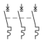
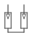
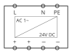
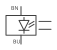
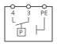
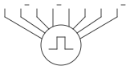

**IEC 60617**

**電氣簡圖用圖形符號　符號速查手冊**

*Graphical symbols for diagrams*

**機電設計工程師適用｜含常用符號速查表、符號閱讀法與 81346-2 字母碼對照**

依據 IEC 60617 線上資料庫（持續更新版）編寫｜81346 系列手冊第六部

2026 年 8 月

**目錄**

**1. 前言**

1.1 本手冊的定位：代號給名字，符號給長相

1.2 60617 是資料庫，不是一本書

1.3 與其他標準的關係

**2. 符號的閱讀法（識圖基本功）**

2.1 未作動狀態原則

2.2 接點的三種基本形

2.3 驅動機構：誰讓接點動作？

2.4 機械連動與符號組合

**3. 常用符號速查**

3.1 導線、連接與接地

3.2 接點與開關

3.3 保護器件

3.4 接觸器與繼電器

3.5 旋轉電機與變壓器

3.6 電源與轉換

3.7 感測器

3.8 指示與訊號

3.9 半導體元件

**4. 設計者指引**

4.1 選符號的決策順序

4.2 60617 沒有的符號怎麼辦

4.3 圖例頁的義務

**5. 實務情境範例**

**6. 常見問答（FAQ）**

**附錄 A：符號分類與 81346-2 字母碼對照總表**

**附錄 B：參考資料**

# 1. 前言

## 1.1 本手冊的定位：代號給名字，符號給長相

前五部手冊建立了命名（81346）、文件編號（61355）、圖面編排（61082-1）與安全要求（60204-1）。還缺最直觀的一塊：圖上那個「兩條線夾一個斜槓」「圓圈裡一個 M」到底是什麼元件？這就是 IEC 60617 的守備範圍——電氣簡圖用的圖形符號。

一個元件在圖面上由兩件事共同定義：**符號**說「它是哪一類東西、現在什麼狀態」，**參考代號**說「它是哪一顆」。看圖時兩者要一起讀：符號畫一個常閉接點、代號寫 -BB1，查 81346-2 知道 B 是感測類——合起來就是「一顆接點常閉的感測開關」。

## 1.2 60617 是資料庫，不是一本書

這是 60617 與其他 IEC 標準最大的不同：它自 2001 年起改為**線上資料庫**（IEC 60617-DB），舊的紙本分冊（60617-2 到 60617-13，按元件類別分冊）已全部廢止。要點：

- 資料庫中每個符號有唯一的識別編號（S 開頭的流水號）、名稱、圖形與使用說明，且持續新增修訂——所以引用時寫「IEC 60617」即可，沒有年份版次。

- 資料庫採訂閱制。一般工程師實務上**不需要直接訂閱**：主流 ECAD 軟體（EPLAN、QET、SEE Electrical 等）的 IEC 符號庫就是 60617 的實作，日常畫圖是「從軟體符號庫選」，而不是「去資料庫查」。

- 但看圖的人需要「認得」常用符號——這正是本手冊第 3 章速查表的目的。

**※ **舊圖或舊教材可能標註「IEC 60617-7」這類分冊編號，那是 2001 年前的紙本體系;符號本身多數沿用至今，對照本手冊速查表閱讀即可。

## 1.3 與其他標準的關係

| 標準 | 角色 | 與 60617 的關係 |
|---|---|---|
| IEC 61082-1 | 圖面編排規則 | 規定符號「怎麼擺」：未作動狀態、可旋轉鏡射、代號標註位置（第四部手冊 2.3 節） |
| IEC 81346-2 | 類別字母碼 | 符號與字母碼一一呼應：馬達符號配 M、閥件符號配 Q（見附錄 A） |
| IEC 81714-2 | 符號設計規則 | 給「做符號庫的人」：自建符號時的線寬、網格、連接點規則 |
| IEC 60204-1 | 機械電氣安全 | 要求圖面依 61082 編製、符號可被辨識——實務上就是用 60617 |

# 2. 符號的閱讀法（識圖基本功）

背符號之前，先學會「拆符號」。60617 的符號是組合式的：==**基本形＋限定符號＝完整意義**==。掌握本章四個規則，沒背過的符號也能推讀出七八成。

## 2.1 未作動狀態原則

==所有符號一律畫「未通電、未作動、未操作」的狀態==（61082-1 的規定，符號依此設計）：

- 接觸器接點：線圈未激磁的常態位置。

- 按鈕：手未按下。

- 行程開關：無機械物碰觸。

- 斷路器／隔離開關：依圖面表達的常態（通常畫合閘前的斷開位置）。

看圖的一切邏輯推演都從這個狀態出發：圖上「開著」的接點，通電後可能是閉的。

## 2.2 接點的三種基本形

接點是電氣圖上出現頻率最高的符號。三種基本形：

| 常開（NO） | 常閉（NC） | 切換（CO） |
|:---:|:---:|:---:|
|  |  |  |
| 未作動＝斷路 | 未作動＝通路 | 一進二出，動作時切換 |

（本手冊符號圖均直接由 QET 元件庫的 .elmt 轉出——你在手冊看到的，就是在 QET 裡選到的長相。歐規慣例接點為垂直畫法：電流由上而下，斜線是可動接點；常閉符號上的小橫鉤，就是斜線「靠著」的短槓。）

- **常開（make contact）**：斜線未搭上導線——未作動時斷路，作動時閉合。

- **常閉（break contact）**：斜線搭在導線末端的小橫槓上——未作動時通路，作動時斷開。

- **切換（change-over contact）**：一個共同點、兩個輸出點，動作時從一邊切到另一邊。

**識圖鐵律：**分不清常開常閉，整張控制圖的邏輯就會全反。==判讀口訣——「斜線懸空＝常開，斜線靠槓＝常閉」。==

## 2.3 驅動機構：誰讓接點動作？

接點符號旁邊（通常是斜線的尾端）掛的小記號，說明這個接點被什麼驅動。這是「同一個接點基本形」長出千百種開關的原因：

| 驅動限定符號 | 意義 | 組合出的元件 | 81346-2 碼 |
|---|---|---|---|
| 虛線連到線圈 | 電磁驅動 | 接觸器／繼電器接點 | Q／K |
| 一橫槓（手動操作柄） | 手動操作 | 一般開關 | S |
| 內凹圓弧（按壓頭） | 按下操作 | 按鈕 | S |
| 蘑菇頭（半圓突起） | 掌打／緊急操作 | 急停按鈕 | S |
| 滾輪 | 機械碰觸 | 行程／極限開關 | B |
| 方框加希臘字母θ或溫度記號 | 溫度作動 | 溫控開關、熱動元件 | B |
| 半圓弧（延時記號，傘形） | 延時作動 | 延時接點（通電延時／斷電延時依弧口方向區分） | K |
| 菱形／壓力記號 | 壓力作動 | 壓力開關 | B |

**※ **延時接點的弧口方向是常見考點：弧口朝動作方向＝該方向延時。實務判讀建議直接對照元件銘牌與圖例頁，不要單憑記憶。

## 2.4 機械連動與符號組合

- **虛線＝機械連動**：兩個符號之間的虛線表示「同一個機構帶動」——三相接觸器的三個主接點畫成三組接點加貫穿虛線，表示同動。

- **多極簡化**：三相迴路常以單線表示，線上畫三條小斜槓「///」（或標「3」）表示實為三條導線；符號也可只畫一極加「3」標記。

- **符號組合**：複雜元件＝基本符號的堆疊。例如「馬達保護開關」＝開關基本形＋熱動限定＋磁動限定；看到陌生符號先拆解成基本形＋限定符號。

# 3. 常用符號速查

以下按功能分類列出機台配電圖最常見的符號。「符號」欄的圖形直接由 QET 元件庫（.elmt）轉出，「外觀」欄以文字描述特徵幫助記憶；每類附 81346-2 主要字母碼，與第二部手冊銜接。少數未附圖的品項，請對照 CAD 符號庫或專案圖例頁。

## 3.1 導線、連接與接地

| 符號 | 元件 | 外觀特徵 | 81346-2 碼 | 備註 |
|:---:|---|---|---|---|
|  | 導線 | 實線；粗線＝主迴路、中線＝控制（61082 線寬規則） | — | |
|  | 連接點 | 交叉處實心圓點 | — | 無點的交叉＝不相連 |
|  | 端子 | 小圓圈（空心） | X | 端子排 -X1 上的一點 |
|  | 插頭／插座 | 半圓（座）對尖角（插） | X | 可分離連接 |
|  | 大地（earth） | 三條由長到短的橫線 | — | 一般接地 |
|  | 保護接地（PE） | 大地符號外加圓圈 | — | 與綠黃導線對應（第七部手冊） |
|  | 機殼／框架 | 斜線排成的短梳狀 | — | 接機殼，非大地 |

## 3.2 接點與開關

| 符號 | 元件 | 外觀特徵 | 81346-2 碼 | 備註 |
|:---:|---|---|---|---|
|  | 常開接點 | 斜線懸空 | 依用途 Q/K/S/B | 2.2 節 |
|  | 常閉接點 | 斜線靠短橫槓 | 依用途 | 2.2 節 |
|  | 手動開關 | 接點＋操作柄橫槓 | S | |
|  | 按鈕（常開） | 接點＋內凹按壓頭 | S | 未按＝斷 |
|  | 急停按鈕 | 接點（常閉）＋蘑菇頭記號 | S | 60204-1 要求直接斷路動作 |
|  | 選擇開關 | 接點＋操作柄＋定位記號 | S | 段數以定位點表示 |
|  | 行程／極限開關 | 接點＋滾輪記號 | B | 位置偵測歸 B 類 |
|  | 隔離開關 | 常開接點＋末端小橫槓（隔離記號） | Q | 有明確隔離位置 |
|  | 負載開關 | 隔離開關＋滅弧記號 | Q | |

## 3.3 保護器件

| 符號 | 元件 | 外觀特徵 | 81346-2 碼 | 備註 |
|:---:|---|---|---|---|
|  | 熔絲 | 長方框，導線貫穿 | F | |
|  | 斷路器 | 常開接點＋× 記號（脫扣機構） | Q | 2019 版 81346-2 中斷路器歸 Q（開關類） |
|  | 三極斷路器 | 三組接點＋虛線同動＋× 記號 | Q | 動力迴路常見 |
|  | 熱過載元件 | 方框內一個「凸」形記號（雙金屬） | B／F | 過載繼電器的偵測部 |
|  | 馬達保護開關 | 三極接點＋熱動＋磁動脫扣的組合 | Q | 2.4 節「符號組合」的實例 |
|  | 剩餘電流裝置（RCD） | 斷路器＋環形互感器記號 | Q | 漏電保護 |
|  | 突波保護器（SPD） | 方框內閃電箭頭＋接地 | F | |

## 3.4 接觸器與繼電器

| 符號 | 元件 | 外觀特徵 | 81346-2 碼 | 備註 |
|:---:|---|---|---|---|
|  | 線圈（操作元件） | 長方框，兩端引線標 A1／A2 | Q（接觸器）／K（繼電器） | 分散表示時線圈下掛接點鏡像 |
|  | 接觸器主接點 | 常開接點＋滅弧記號；三極以虛線同動 | Q | 端子 1-2／3-4／5-6 |
|  | 輔助接點 | 單組常開或常閉 | | 端子 13-14（NO）、21-22（NC） |
|  | 延時線圈 | 線圈框＋延時記號 | K | 通電延時／斷電延時 |
|  | 延時接點（通電延時常開） | 接點＋延時傘形記號 | K | 弧口方向見 2.3 節 |
|  | 脈衝繼電器／閂鎖 | 線圈框＋閂鎖記號 | K | |

分散表示時,上表的「主接點」畫在動力迴路頁、「線圈」畫在控制迴路頁,兩者靠同一個參考代號(-QA2)與線圈下方的接點鏡像互相連回——版面細節見第四部手冊 4.2/4.3 節。

## 3.5 旋轉電機與變壓器

| 符號 | 元件 | 外觀特徵 | 81346-2 碼 | 備註 |
|:---:|---|---|---|---|
|  | 三相馬達 | 圓圈內大寫 **M** 加「3∼」；端子 U1/V1/W1 | M | 最好認的符號 |
|  | 單相馬達 | 圓圈內大寫 **M** 加「1∼」 | M | |
|  | 發電機 | 圓圈內大寫 **G** | G | |
|  | 變壓器 | 兩組線圈記號相對（單線圖：兩個相扣圓圈） | T | |
|  | 電抗器 | 線圈記號（半圓弧＋直線） | R（限流用途）／T | |
|  | 自耦變壓器 | 單線圈加抽頭 | T | |

## 3.6 電源與轉換

| 符號 | 元件 | 外觀特徵 | 81346-2 碼 | 備註 |
|:---:|---|---|---|---|
|  | 電池 | 長短線相間（長＝正、短＝負） | G | |
|  | 整流器 | 菱形橋＋二極體記號（單體：方框內對角線分隔，一側∼一側⎓） | T | AC→DC |
|  | 變頻器 | 方框內∼／∼加頻率記號 | T | 2019 版歸 T（能量轉換） |
|  | 電源供應器 | 方框＋輸入輸出電壓標示 | T | 如 24 V DC 電源 |

**※ **變頻器、伺服驅動器的分類是 81346-2 新舊版差異的重災區（舊版慣用 U 類）。看舊圖遇到 -U1 驅動器不要驚訝，對照專案的版本宣告（第二部手冊 1.3 節）。

## 3.7 感測器

| 符號 | 元件 | 外觀特徵 | 81346-2 碼 | 備註 |
|:---:|---|---|---|---|
|  | 接近開關 | 菱形接近記號＋接點 | B | 電感／電容式 |
|  | 光電開關 | 方框＋光線箭頭記號 | B | 圖為三線式（BN/BU 接電源） |
|  | 壓力開關 | 接點＋壓力記號（P） | B | |
|  | 溫度開關 | 接點＋θ／溫度記號 | B | 溫度到達即動作 |
|  | 熱電偶 | V 形雙金屬線＋極性 | B | 溫度量測（PT100 亦屬此類） |
|  | 液位開關 | 接點＋浮球記號 | B | |
|  | 編碼器 | 圓圈＋角度記號 | B | 位置回授 |

## 3.8 指示與訊號

| 符號 | 元件 | 外觀特徵 | 81346-2 碼 | 備註 |
|:---:|---|---|---|---|
|  | 指示燈 | 圓圈內打叉（×貫穿） | P | 顏色標於旁（見 60204-1 手冊 5.5） |
|  | 蜂鳴器 | 半圓開口形 | P | |
|  | 喇叭 | 梯形喇叭口 | P | |
|  | 電表 | 圓圈內標 A／V | P | 電流表／電壓表 |
|  | 計數器／計時器 | 方框內標 h 或計數記號 | P | 運轉時數表 |

## 3.9 半導體元件

| 符號 | 元件 | 外觀特徵 | 81346-2 碼 | 備註 |
|:---:|---|---|---|---|
|  | 二極體 | 三角形頂一橫槓（電流順三角方向） | R／T | 續流、防反接 |
|  | LED | 二極體＋兩支外射小箭頭 | P（指示用途） | |
|  | 齊納二極體 | 二極體橫槓帶折角 | | 穩壓 |
|  | 光耦合器 | LED 對光電晶體，同框 | K／B | 訊號隔離 |

# 4. 設計者指引

## 4.1 選符號的決策順序

1. **先查 CAD 符號庫的 IEC 分類**——主流軟體已對應 60617,別自己畫。

2. **庫裡沒有 → 用基本形＋限定符號組合**（2.4 節）,組合結果收入專案圖例頁。

3. **組合不出來（新式元件）→ 依 IEC 81714-2 的設計規則自建符號**：沿用庫的網格與線寬、連接點落在網格上、意義不得與既有符號衝突。

4. **自建符號必須進圖例頁**,並全案唯一。

## 4.2 60617 沒有的符號怎麼辦

安全繼電器、IO-Link 主站、機器人控制器這類新元件,60617 未必有現成符號。實務慣例：

- 用**方框符號**（black box）表示：長方框＋內部功能標字＋端子引線,框上掛參考代號與型號。

- 端子名照製造商手冊標註,讓接線圖查得到。

- 61082-1 允許方框表示法——複雜裝置本來就建議畫框,把細節留給裝置手冊。

## 4.3 圖例頁的義務

只要用了下列任何一項,圖冊第一頁（或圖例頁）就必須交代：自建／組合符號、非預設的線寬約定、特殊限定記號。原則：**==讀圖的人不需要猜==**（61082-1,第四部手冊 6 章七步讀圖法的第一步就是讀圖例頁）。

# 5. 實務情境範例

**情境：拆讀一個沒見過的符號。**圖上有個符號：方框、內有θ、旁邊接點斜線靠槓、代號 -BB3。拆解：

1. 接點斜線靠槓 → 常閉（2.2 節）。

2. θ 記號 → 溫度驅動（2.3 節）。

3. 代號 B 開頭 → 81346-2 感測類（第二部手冊）。

4. 結論：溫度開關,常閉型——溫度正常時通路,過溫斷開。再查端子圖知道它串在哪個迴路,不用翻任何型錄就完成判讀。

**情境：審圖抓錯。**新人畫的圖:急停按鈕用了常開接點。對照 2.2／3.2 節與 60204-1（第五部手冊 5.4 節）:==急停必須用常閉直接斷路——常開接點斷線時急停會失效。==符號畫錯不是美觀問題,是安全問題。

# 6. 常見問答（FAQ）

### Q1：60617 資料庫要付費,我要買嗎？

一般設計者不用。CAD 的 IEC 符號庫已涵蓋日常所需;需要訂閱的是開發符號庫的軟體商與制定企業標準的部門。

### Q2：美規（NEMA／JIC）符號和 60617 差在哪？

同一元件兩套畫法：例如常開接點,IEC 畫斜線,JIC 畫兩短豎線「⊣⊢」;熱過載 IEC 畫方框凸形,JIC 畫圓圈內 OL。外銷北美的圖用 JIC 體系,不要混用（第四部手冊 FAQ Q2）。

### Q3：同一顆元件,符號可以旋轉或鏡射嗎？

可以,61082-1 允許依版面旋轉、鏡射、縮放,但意義不得改變、代號文字保持水平可讀。

### Q4：QET 的符號庫跟 60617 一致嗎？

QET 內建 IEC 風格符號庫,常用符號與 60617 對應;但社群貢獻的元件品質不一,關鍵符號（急停、安全迴路）出圖前要人工核對外觀與接點型式。

### Q5：PLC 的 I/O 怎麼畫？

PLC 本體用方框符號（4.2 節）,每個 I/O 點畫一條引線＋端子號＋訊號名;梯形圖邏輯屬軟體文件,不畫在電路圖裡,兩者以 I/O 清單（61355 的 &EMB 類）銜接。

# 附錄 A：符號分類與 81346-2 字母碼對照總表

| 圖上看到的符號 | 它是 | 81346-2 碼 | 速查章節 |
|---|---|---|---|
| 圓圈 M | 馬達 | M | 3.5 |
| 圓圈 G | 發電機／電池組 | G | 3.5／3.6 |
| 長方框（兩端 A1/A2） | 線圈 | Q／K | 3.4 |
| 三接點＋貫穿虛線 | 接觸器主接點 | Q | 3.4 |
| 長方框（導線貫穿） | 熔絲 | F | 3.3 |
| 接點＋× 脫扣記號 | 斷路器 | Q | 3.3 |
| 接點＋滾輪 | 行程開關 | B | 3.2 |
| 接點＋蘑菇頭 | 急停按鈕 | S | 3.2 |
| 圓圈打叉 | 指示燈 | P | 3.8 |
| 兩個相扣圓圈 | 變壓器 | T | 3.5 |
| 方框 ∼/⎓ | 整流／變頻 | T | 3.6 |
| 方框＋θ | 溫度元件 | B | 3.7 |
| 三橫線遞減 | 接地 | — | 3.1 |
| 空心小圓 | 端子 | X | 3.1 |

# 附錄 B：參考資料

- IEC 60617, Graphical symbols for diagrams（線上資料庫,持續更新）.

- IEC 61082-1:2014（符號使用規則,本系列第四部手冊）.

- IEC 81346-2:2019（類別字母碼,本系列第二部手冊）.

- IEC 81714-2, Design of graphical symbols — Part 2（自建符號的設計規則）.

- IEC 60204-1（急停等安全元件的行為要求,本系列第五部手冊）.

（本手冊為教學性整理文件;符號外觀以文字描述輔助記憶,實際圖形以 IEC 60617 資料庫與專案圖例頁為準,正式設計請以標準原文為準。）
