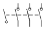
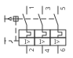

**IEC 60204-1**

**機械電氣設備安全　設計與識圖手冊**

*Safety of machinery — Electrical equipment of machines — Part 1: General requirements*

**機電設計工程師適用｜含安全設計檢核、顏色識別與驗證測試指南**

依據 IEC 60204-1:2016(第 6 版)編寫｜81346 系列手冊第五部

2026 年 7 月

**目錄**

**1. 前言**	3

1.1 第五部的定位:命名與圖面之後,內容要安全	3

1.2 適用範圍與版本	3

1.3 與其他安全標準的關係	3

1.4 條文地圖	3

**2. 供電引入與隔離(第 5 章)**	4

**3. 感電防護(第 6 章)**	4

**4. 設備保護與等電位連結(第 7、8 章)**	5

**5. 控制迴路與安全功能(第 9、10 章)**	5

5.1 控制電源與控制電壓	5

5.2 停止功能三類別	5

5.3 急停	6

5.4 接地側規則:斷線不得引起誤啟動	6

5.5 操作器與指示燈顏色	6

**6. 導線與配線實務(第 12、13 章)**	6

**7. 標示與技術文件(第 16、17 章)**	7

**8. 驗證測試(第 18 章)**	8

**9. 實務情境範例**	8

9.1 情境一:輸送機電控的 60204 檢核走查	8

9.2 情境二:急停類別怎麼選	9

9.3 情境三:看圖識安全	9

9.4 情境四:出廠驗證測試流程	10

**10. 常見問答(FAQ)**	10

**附錄 A:顏色語言總表**	11

**附錄 B:參考資料**	11

# 1. 前言

## 1.1 第五部的定位:命名與圖面之後,內容要安全

先講白話版:前四部手冊教你「元件怎麼取名字(81346)、文件怎麼編號(61355)、圖怎麼畫(61082)」——這些都是「表達方式」的規範。但一張畫得再漂亮、命名再工整的圖,裡面的設計本身可能是危險的:急停接錯型式的接點、主開關切不斷的電沒人標、保護接地靠門鉸鏈導通。

IEC 60204-1 管的就是「內容」——機台的電氣設備本身要符合哪些安全要求:

- 供電怎麼切、怎麼鎖,維修的人才敢把手伸進盤裡;
- 感電怎麼防,操作員摸到外殼不會出事;
- 急停怎麼做,拍下去要真的停、復位不能自己再跑;
- 線用什麼顏色,看一眼就知道哪條碰不得;
- 出廠前要測什麼,才能證明以上都做到了。

它是機械電氣設計的「內容規範」,也是 CE 認證與多數客戶規範指名引用的基準文件。你可以這樣記:**前四部教你「怎麼說」,60204-1 教你「說的內容要安全」。**

💡 為什麼看圖的人也要懂這本?因為 60204-1 定義了一整套「顏色語言」——橘色的線、紅蘑菇配黃底的按鈕、綠黃雙色的導體、紅黃配色的把手。每一個顏色都是標準規定的訊息,看不懂顏色語言的人,在盤前就是在用性命猜謎。本手冊後半與附錄 A 會把這套語言整理成一張總表。

## 1.2 適用範圍與版本

**適用範圍(白話拆解):**

- **管什麼設備:**機械的電氣、電子與可程式電子設備——從接觸器(現場稱電磁接觸器 MC)、馬達到 PLC、變頻器(INV)都算。
- **從哪裡開始管:**「供電引入點」——就是把廠內電源接進機台的那一點(通常是主開關的進線端子)。引入點之前是工廠配電的事(歸建築電氣規範管),引入點之後全部歸 60204-1。你可以想像機台圍了一圈線,電跨進這圈線的那一點就是起點。
- **電壓上限:**額定電壓不超過 AC 1 000 V/DC 1 500 V——一般產業機械幾乎都在範圍內。

**版本:**現行版本為 IEC 60204-1:2016(第 6 版),歐盟調和版為 EN 60204-1:2018。第 6 版相較 2005 年版的重點更新:

| **更新項目** | **對你的意義** |
|---|---|
| 納入動力驅動系統(PDS/變頻器,含 STO 安全轉矩關斷) | 急停可以用變頻器的 STO 實現,不一定要拉接觸器(見 5.3) |
| 修訂 EMC 與過電流保護要求 | 變頻器機台的濾波與保護協調要更講究 |
| 修訂等電位連結術語 | 「接地」相關名詞更精確(見 4.2) |
| 強化技術文件要求 | 前四部手冊的成果在此變成交付義務(見 7.2) |

## 1.3 與其他安全標準的關係

機械安全標準是一個分工體系,先認識 A/B/C 三個層級:A 類是「總則」(方法論)、B 類是「共通技術」(某一類危險或某一類手段)、C 類是「特定機種」(直接告訴你這種機器怎麼做)。

| **標準** | **角色** | **分工** |
|---|---|---|
| ISO 12100 | 機械安全總則(A 類標準) | 風險評估的方法論;60204-1 的上位框架 |
| IEC 60204-1 | 電氣設備一般要求(B 類) | 本手冊主題:電氣安全的「基本功」 |
| ISO 13849-1/IEC 62061 | 控制系統功能安全(B 類) | 安全迴路的 PL/SIL 等級計算——60204-1 不涵蓋 |
| ISO 13850 | 急停原則(B 類) | 急停裝置的功能與人因要求,與 60204-1 併用 |
| 各機種 C 類標準 | 特定機械(如沖床、CNC) | 有 C 類時,其電氣條款優先於 60204-1 |

⚠️ 常見誤解:60204-1 合規=安全迴路合規。錯——==急停迴路要做到哪個 PL 等級是 ISO 13849-1 的事,60204-1 只規定急停的電氣行為(類別、顏色、復位)。兩者都要做。==

打個比方:60204-1 說「急停要紅蘑菇黃底、常閉接點、拍下要保持」,這是急停的「長相與行為」;ISO 13849-1 說「這條急停迴路壞掉的機率要低到什麼程度、要不要雙迴路、要不要監視」,這是急停的「可靠度」。長相對了但可靠度不夠,一樣不合格。

## 1.4 條文地圖

60204-1 的章節編號本身就是一張地圖,本手冊各章都會標明對應的條文章號,方便你回查原文:

| **條** | **主題** | **條** | **主題** |
|---|---|---|---|
| 4 | 一般要求與環境條件 | 12 | 導線與電纜 |
| 5 | 供電引入與切斷裝置 | 13 | 配線實務 |
| 6 | 感電防護 | 14 | 馬達及其附屬設備 |
| 7 | 設備保護(過電流等) | 15 | 插座與照明 |
| 8 | 等電位連結 | 16 | 標示與警告 |
| 9 | 控制迴路與控制功能 | 17 | 技術文件 |
| 10 | 操作介面與控制器件 | 18 | 驗證(測試) |
| 11 | 控制設備的安置與外殼 |  |  |

# 2. 供電引入與隔離(第 5 章)

## 2.1 供電切斷裝置:維修者的保命開關

每台機器須設「供電切斷裝置」(supply disconnecting device)——白話說就是機台的「總開關」,維修人員賴以確保「整台機器無電」的那一支開關。想像維修技師要把手伸進盤內換接觸器,他敢伸手的唯一理由,就是他親手把這支開關扳到 OFF、掛上自己的鎖。所以這支開關的每一項設計要求,背後都是那隻手:

 

- **型式:**隔離開關(可加熔絲)、具隔離功能的斷路器(現場稱 NFB/無熔絲開關)、負載開關等;必須看得出明確的隔離位置,操作件標示 O/I。
  - 為什麼強調「隔離功能」?一般接觸器斷開後接點間距小、也可能熔黏,你從外面看不出裡面到底斷了沒。「隔離」等級的開關保證斷開距離、且把手位置忠實反映接點狀態——==把手指 O,裡面就真的斷開,這才叫隔離。==

- **位置與操作:**易於接近,外部操作把手建議安裝高度 0.6~1.9 m;把手顏色黑或灰——若兼作緊急切斷用途才用紅色配黃底。
  - 為什麼管把手顏色?因為紅黃配色在這套語言裡專屬「緊急」。如果每台機的主開關都做紅色,真正緊急時操作員反而分不出哪支是急停用的。

- **可上鎖:**須可在 OFF 位置上鎖(掛鎖),支援上鎖掛牌(LOTO,Lockout/Tagout)程序。
  - LOTO 白話解釋:維修者關開關 → 掛上「自己的」鎖 → 鑰匙放自己口袋 → 掛牌寫明「維修中勿送電」。為什麼要鎖?想像事故畫面:技師在盤內接線,另一個班的操作員路過,以為機器「怎麼沒開」,順手把開關扳上——技師的手正握著母線排。掛鎖的意義是:==只要有人的鎖還掛在主開關上,任何人都不得送電——那把鎖的背後是一雙還在盤內的手。==

- **切斷範圍:**切斷後機台原則上全部失電——維修者才能建立「一支開關=整台無電」的信任。

## 2.2 例外迴路:主開關關了還有電的地方

少數迴路可以不經切斷裝置(excepted circuits)——因為切了反而更危險或不合理:

| **例外迴路** | **為什麼要例外** |
|---|---|
| 維修照明 | 關了主開關,盤內一片黑,還怎麼修? |
| 僅供維修用插座 | 維修時要接電鑽、筆電,不能跟著斷 |
| 防止工件掉落的夾持迴路 | 斷電夾爪鬆開,工件砸下來 |
| 跨機互鎖訊號 | 這台關了,別台還在跑,互鎖訊號得活著 |

但例外的代價是嚴格的識別義務:!!這些「主開關關了還有電」的導線須以**橘色**識別,並在切斷裝置附近設警告標示。!!

為什麼這條是保命鐵律?事故畫面:技師照 LOTO 程序關了主開關、掛了鎖、用驗電筆確認主迴路無電,開始拆線——碰到維修插座迴路的端子,那一路根本不經主開關,230 V 還活著。橘色就是設計者留給下一個人的遺言等級警告:==看到橘色線,先當它有電,驗電確認後才碰。==警告標示則掛在主開關旁,列出「本開關切不斷的迴路有哪些、由哪裡供電」——讓維修者知道要去哪裡把它們也切掉。

## 🚫 常見踩坑(第 2 章)

| **錯誤做法** | **會發生什麼** | **正確做法** |
|---|---|---|
| 用普通接觸器當「總開關」,以為斷電就是隔離 | 接點熔黏或外部看不出實際狀態,維修者以為無電而觸電 | 用具隔離功能的裝置,把手位置忠實反映接點,標示 O/I |
| 主開關把手做紅色「比較醒目」 | 與急停/緊急切斷的紅黃語意混淆,緊急時操作員拍錯 | 一般主開關用黑或灰;只有兼緊急切斷功能才紅配黃底 |
| 維修插座迴路省成本用一般黑線 | 下一個維修者關主開關後誤觸帶電端子 | 例外迴路全程橘色識別+主開關旁警告標示 |
| 主開關裝在盤頂內側、要開門才搆得到 | 緊急或維修時無法快速切電;開門本身就先暴露帶電部 | 外部操作把手,高度 0.6~1.9 m,不開門即可操作 |

# 3. 感電防護(第 6 章)

感電防護的邏輯是「兩層防線」,你可以用工地的比喻記:安全帽(第一層,別讓東西砸到頭)+安全網(第二層,萬一掉下去還有網接住)。

## 3.1 直接接觸防護(基本防護):人不能摸到帶電部

第一層防線:設備一切正常時,人的手指不能碰到任何帶電的東西。手段:

- **外殼或障板:**開門即可觸及的帶電部至少 IP2X/IPXXB——白話說就是「標準測試手指伸不進去」。IP2X 的「2」代表直徑 12.5 mm 的物體(約成人手指)進不去。
  - 為什麼?事故畫面:操作員開盤門找復位鈕,手指往端子排一掃——如果 230 V 端子裸露,這一掃就是電擊。加了端子護蓋(障板),手指掃到的只是塑膠。
- **門與帶電部的聯鎖(開門斷電)**或**使用工具才能開啟**:兩選一的邏輯是——要嘛門一開電就斷,要嘛確保「會拿工具開門的人」是受過訓練、知道自己在幹嘛的人。
- **帶電作業面板加障板:**維修中必須通電量測時,把不需要碰的帶電區先擋起來。

## 3.2 故障防護(間接接觸防護):壞掉時人也不能受害

第二層防線:當絕緣失效、外露可導電部(盤體、馬達外殼)意外帶電時,人摸到也不能出事。

事故畫面(沒有第二層會怎樣):馬達內部繞組絕緣劣化,相線碰到外殼——外殼從此帶 230 V,外觀完全看不出來。下一個伸手摸馬達的人就是回路的一部分。

主要手段:**自動切斷電源**——故障電流經保護連結迴路(第 8 章的綠黃線系統)流回電源,形成大電流,讓過電流保護裝置在規定時間內跳脫。==白話口訣:接地線不是「把電導走就沒事」,而是「製造夠大的故障電流,逼保護裝置快點跳脫」。==輔以 RCD(剩餘電流裝置,俗稱漏電斷路器)等:

💡 RCD 的原理白話版:它比較「流出去的電」和「流回來的電」——正常時兩者相等;如果有電流「漏」去別的地方(例如經過人體流到地),進出不平衡,RCD 立刻跳脫。

## 3.3 PELV:為什麼 24 V 可以裸端子

**PELV(保護性特低電壓,Protective Extra-Low Voltage):**常用的 24 V DC 控制電壓屬此範疇。白話說:電壓低到「摸到也不致造成危險電擊」,所以標準允許放寬第一層防線。

==PELV 免直接接觸防護的條件:乾燥場所、額定不超過 AC 25 V/DC 60 V(無漣波)等——這是為什麼 24 V 感測器接線可以裸露端子,而 230 V 迴路不行。==

⚠️ 但 PELV 不是「隨便一顆 24 V 電源」都算:迴路須由**安全隔離變壓器或等效電源**供電(確保高壓側故障不會竄到低壓側),且迴路一點接地。一顆來路不明、隔離等級不足的電源,故障時 230 V 可能直通你以為安全的 24 V 端子。

## 🚫 常見踩坑(第 3 章)

| **錯誤做法** | **會發生什麼** | **正確做法** |
|---|---|---|
| 盤門內 230 V 端子排不加護蓋,「反正會開門的都是自己人」 | 操作員開門按復位,手指掃到端子被電擊 | 開門即可觸及的帶電部做到 IP2X/IPXXB(加障板或護蓋) |
| 用普通雙繞組變壓器供 24 V 就當作 PELV | 變壓器層間絕緣失效時高壓竄入,「安全電壓」端子變 230 V | PELV 必須用安全隔離變壓器或等效電源,並一點接地 |
| 把「有接地」當成感電防護的全部 | 保護裝置跳脫時間不足時,外殼帶電期間有人碰到照樣出事 | 接地+保護裝置協調(故障迴路阻抗要讓它在規定時間內跳),必要時加 RCD |

# 4. 設備保護與等電位連結(第 7、8 章)

## 4.1 過電流與馬達保護(第 7 章)

- **每個迴路都要有過電流保護**(熔絲或斷路器)。為什麼?短路電流可達正常電流的幾十倍,沒有保護的導線會在秒級內過熱、絕緣熔毀、起火——過電流保護是「線著火之前先斷電」的裝置。

- **分斷能力 ≥ 安裝點的預期短路電流**——這就是要求「短路電流額定(SCCR)」計算的來源。白話解釋:斷路器不是「什麼電流都斷得掉」,超過它分斷能力的短路電流,可能讓它斷不開、甚至爆裂。事故畫面:小容量斷路器裝在大變壓器旁,短路瞬間斷路器外殼炸開、電弧噴出盤外。==所以選保護裝置要先問:這個安裝點的最大短路電流是多少?==

- **0.5 kW 以上的馬達原則上須設過載保護**(熱過載電驛、電子式過載或內建熱敏元件),並考慮堵轉與缺相。

  

  - 為什麼?馬達卡死(堵轉)時電流暴增但不到短路等級——斷路器不跳,馬達繞組卻在幾十秒內燒毀。過載保護就是模擬馬達的發熱曲線,「熱到危險前」先跳脫。缺相(三相少一相)則會讓剩下兩相電流上升、馬達悶燒,也要能偵測。

- **必要時設過電壓/突波保護與電源異常(欠壓)保護**——!!欠壓復電後不得自行重新起動。!!事故畫面:全廠跳電,操作員趁機清理輸送帶上的卡料,手還在皮帶上——電來了,機器自己跑起來。正確行為:復電後機器保持停止,等人按下起動鈕才動(這與 5.4 接地側規則是同一種「防非預期啟動」的思想)。

## 4.2 等電位連結(第 8 章)

「等電位連結」聽起來抽象,白話說就是:==把所有人摸得到的金屬(盤體、機架、馬達外殼、門)用綠黃線連成一體、接到 PE,讓它們永遠跟大地同電位——摸到任何一件金屬都跟摸大地一樣,沒有電位差就沒有電流過人體。==

- **保護連結迴路:**PE 端子+所有外露可導電部連成連續導電迴路。**門上裝了電氣器件,就要有專用連結導體(軟編織線),不能靠鉸鏈。**
  - 為什麼鉸鏈不行?鉸鏈有油漆、油脂、鏽,接觸電阻不穩定,開合幾千次後更不可靠。事故畫面:門上的按鈕盒內部線磨破碰到門板,門「應該」經鉸鏈接地讓保護跳脫——但鉸鏈電阻太大,故障電流不夠、保護不跳,門板持續帶電,下一個開門的人被電擊。

- **導體規格:**保護導體以綠黃雙色識別(全長);截面積依相導體大小配比(小迴路同截面、大迴路依表配)。

- **連續性是可測的:**第 18 章要求實測保護連結迴路的連續性(低電阻量測)——設計時每個連結點都要想「測試棒搆得到嗎」。畫圖時多留一顆測試點,出廠測試省半小時。

## 🚫 常見踩坑(第 4 章)

| **錯誤做法** | **會發生什麼** | **正確做法** |
|---|---|---|
| 選斷路器只看額定電流,不算 SCCR | 大短路電流時斷路器斷不開甚至爆裂、電弧傷人 | 先算安裝點預期短路電流,分斷能力必須不小於它 |
| 馬達只裝斷路器、省掉過載保護 | 堵轉/缺相時電流不到跳脫值,馬達悶燒起火 | 0.5 kW 以上馬達設過載保護,並考慮堵轉與缺相 |
| 盤門接地靠鉸鏈,「金屬碰金屬就是通」 | 門上器件漏電時故障電流不足、保護不跳,門板帶電 | 門加專用綠黃軟編織線,一端門側、一端框側 |
| 復電自動重啟「省得操作員再按一次」 | 跳電時有人進入危險區,復電機器突然動作 | 欠壓復電後保持停止,必須由人重新下起動命令 |

# 5. 控制迴路與安全功能(第 9、10 章)

## 5.1 控制電源與控制電壓

- **交流控制迴路原則上由控制變壓器(隔離繞組)供電,不得直接取相電壓。**為什麼?三個理由:隔離(控制迴路故障不直通電源)、降壓(把控制電壓降到較安全等級)、限故障能量(變壓器容量有限,短路電流小)。直接拿 220 V 相電壓跑整盤控制線,等於讓每一顆按鈕、每一條細線都扛著電源的全部故障能量。

- 多個變壓器時二次側極性一致——否則兩組控制電源之間有電位差,跨接時燒給你看。

- 直流控制常用 24 V DC(PELV,見 3.3);控制電壓上限依條文與地區差異(如北美慣用 120 V AC 上限)。

- ==控制迴路須有自己的過電流保護,且保護協調到「控制迴路故障不會失去停止功能」==——白話說:控制迴路的熔絲跳了,機器要停下來,而不是「停止鈕失效但機器繼續跑」。

## 5.2 停止功能三類別

「停止」不是只有一種。60204-1 把停止分成三類,先看表再看白話:

| **類別** | **名稱** | **行為** | **典型應用** |
|---|---|---|---|
| **0** | 非受控停止 | 立即切斷致動器電源,任其自由停止 | 簡單機構、危險時要求立即斷電者 |
| **1** | 受控停止 | 保持電源進行受控減速,停止後才斷電 | 大慣量負載、垂直軸——先煞住再斷電 |
| **2** | 運轉性停止 | 受控停止但停止後電源仍保持 | 一般操作停止(非安全停止) |

白話比喻(騎機車):

- **類別 0** =直接熄火拔鑰匙,車滑行到停——最快斷能量,但停多遠看慣性;
- **類別 1** =先煞車煞到停,再熄火拔鑰匙——受控、停得快,停妥後也無能量;
- **類別 2** =煞車煞到停,但引擎還發動著——隨時能再走,所以只算「操作上的停」,不算安全上的停。

每台機器必須具備類別 0 停止功能;!!急停只能用類別 0 或 1——類別 2 因為停後仍帶電,不得作為急停。!!

為什麼類別 2 不能當急停?事故畫面:操作員拍了「急停」,機器停了,他放心把手伸進去排除卡料——但那是類別 2,伺服還在使能狀態,一個雜訊、一個程式誤動作,軸就動了,手還在裡面。**急停的承諾是「拍下去之後,能量真的被切掉或耗掉」,類別 2 給不了這個承諾。**

## 5.3 急停

急停是整台機器最後一道由「人」啟動的防線,60204-1 對它的每一條要求,背後都有一個事故畫面:

- **急停動作優先於一切其他功能。**任何模式、任何程式狀態下,拍急停都必須有效——不能有「自動模式下急停被程式跳過」這種設計。

- **觸發後停止命令必須保持,直到在「該急停裝置上」手動復位。**為什麼是「該裝置上」?事故畫面:A 站的人拍了急停進去排障,B 站的人不明就裡在 B 站把系統復位——如果任何一站都能解除 A 站的急停,拍急停的人就失去了對自身安全的控制權。==誰拍的急停,必須回到那顆按鈕上旋開,別人在別處解不掉。==

- !!復位本身不得重新起動機器——旋開急停只是「允許再起動」,機器必須等到有人另外按下起動鈕才能動。!!事故畫面:技師排除完卡料,旋開急停準備走出圍籬——機器在他旋開的瞬間直接起動,他人還在裡面。「復位≠起動」是用命換來的一條規則。

- **裝置要求(併用 ISO 13850):**紅色蘑菇頭、黃色背景、自鎖(拍下卡住)、每個操作站均可及,且——!!急停必須使用直接開路動作(強制斷開)的**常閉**接點。!!
  - 為什麼必須常閉(NC)?這叫「失效導向安全」:常閉接點平時導通,迴路有電=安全鏈完好;哪天線斷了、接頭鬆了,迴路自然斷開——機器停下來,故障「自己暴露」。反過來,若用常開(NO)接點:平時斷路,線斷了外觀毫無異狀,直到有人真的拍急停那一刻,才發現訊號根本傳不出去——機器不停,而那正是最需要它停的時刻。
  - 為什麼要「直接開路動作」(強制斷開)?一般接點靠彈簧分開,接點熔黏時彈簧無能為力;強制斷開機構是「按鈕的機械行程硬把接點掰開」——就算熔黏也被物理性撕開。急停不允許「按下去了,接點卻黏著沒斷」。

- **與變頻器搭配:**第 6 版明確接納 PDS 的 STO(安全轉矩關斷)作為實現停止類別 0/1 的手段——急停可以經安全繼電器觸發變頻器 STO,不一定要拉接觸器斷主電。💡 STO 白話解釋:變頻器內部切斷輸出功率級的驅動訊號,馬達從此出不了力矩——電源還在,但「肌肉」被卸了。前提:迴路的功能安全等級依 ISO 13849-1 驗證(見 1.3 的分工)。

## 5.4 接地側規則:斷線不得引起誤啟動

控制迴路一點接地時,元件佈置有一條經典規則:==線圈的一端直接接到接地側,所有開關接點放在非接地側。==

為什麼?看兩種接法在「一條線磨破碰到機架(對地短路)」時的差別:

| **接法** | **對地短路時發生什麼** | **結果** |
|---|---|---|
| 接點在非接地側、線圈貼接地側(正確) | 短路點等於把電源直接對地——燒熔絲,或線圈失電 | 機器停(安全側失效) |
| 線圈在非接地側、接點貼接地側(錯誤) | 短路點繞過所有開關接點,直接把線圈接通 | 線圈誤激磁,機器**自己啟動** |

事故畫面:拖鏈裡一條控制線外皮磨破碰到機架——正確接法下,頂多熔絲跳、機器停;錯誤接法下,起動接觸器無人操作自行吸上,機器在沒人下令的情況下跑起來。所以看階梯圖時你會發現所有線圈都貼著右母線(接地側)——這不是美觀習慣,是安全條款。改圖時也一樣:接點永遠加在線圈的「電源側」,不要塞到線圈與接地側母線之間。

## 5.5 操作器與指示燈顏色

按鈕與指示燈的顏色是標準化的人機語言——目的是讓操作員「不用讀字,看顏色就知道意思」,而且換一台機器、換一個廠牌,語言不變:

| **器件** | **顏色** | **意義/規定** |
|---|---|---|
| 急停按鈕 | 紅(黃底) | 專用;不得用紅色做其他按鈕的主色 |
| 起動按鈕 | 白(優先)、灰、黑;綠可用 | 避免用紅 |
| 停止按鈕 | 黑(優先)、灰、白;紅可用 | 不得用綠 |
| 復位按鈕 | 藍、白、灰、黑 | 兼起動用途時依起動色 |
| 指示燈:紅 | 緊急/故障 | 需立即處理的異常 |
| 指示燈:黃 | 異常 | 注意、參數超限 |
| 指示燈:綠 | 正常 | 正常運轉/就緒 |
| 指示燈:藍 | 強制動作 | 要求操作者做某事 |
| 指示燈:白 | 中性 | 一般資訊(運轉中等) |

💡 為什麼起動避免用紅、停止不得用綠?因為紅=危險/停、綠=安全/行是深入人心的直覺。**「綠色的停止鈕」在緊急時會害操作員猶豫半秒——那半秒可能就是一隻手。**也因此紅色按鈕保留給急停與停止語意,不做他用。完整的顏色語言(燈、按鈕、線、把手)整理在附錄 A 一張總表。

## 🚫 常見踩坑(第 5 章)

| **錯誤做法** | **會發生什麼** | **正確做法** |
|---|---|---|
| 急停接常開接點,PLC 收到訊號才下停止命令 | 斷線時故障隱藏;真正拍急停時訊號傳不出去,機器不停 | 常閉+直接開路動作接點,斷線即停、故障自暴露 |
| 急停走一般 PLC 輸入、由程式決定要不要停 | 程式當機/被旁路時急停失效 | 急停經安全繼電器/安全迴路硬體動作,優先於一切功能 |
| 旋開急停機器立即恢復運轉 | 排障者還在危險區內,機器在他復位瞬間動作 | 復位只是允許再起動,必須另按起動鈕機器才能動 |
| 用類別 2 停止當急停,「反正機器停了」 | 停止後伺服仍使能,誤動作時人在機器內 | 急停只能類別 0 或 1,停妥後能量必須切斷或耗盡 |
| 階梯圖把接點畫在線圈與接地母線之間 | 該段線對地短路即繞過接點,線圈誤激磁、機器自啟 | 線圈一端直上接地側母線,所有接點放非接地側 |
| 控制迴路直接取相電壓,省一顆控制變壓器 | 控制線短路時故障能量大;細線與器件承受全電源衝擊 | 交流控制經控制變壓器(隔離繞組)供電 |

# 6. 導線與配線實務(第 12、13 章)

## 6.1 導線顏色

導線顏色讓人在盤內「看線知迴路」——老手開盤第一眼不是看線號,是看顏色分佈:黑的是動力、藍的是 DC 控制、綠黃的是地。標準的固定規定與建議色碼:

| **顏色** | **用途** | **性質** |
|---|---|---|
| 綠/黃雙色 | 保護導體(PE) | 強制專用——嚴禁移作他用 |
| 淺藍 | 中性線(N) | 建議專用 |
| 黑 | 交流與直流動力迴路 | 建議色碼 |
| 紅 | 交流控制迴路 | 建議色碼 |
| 藍 | 直流控制迴路 | 建議色碼 |
| 橘 | 例外迴路(主開關切不斷的電) | 識別義務——見第 2 章 |

注意「強制」與「建議」的分界:!!綠黃雙色線只能當保護導體(PE)使用——嚴禁拿它跑訊號、跑電源,也嚴禁拿別的顏色當 PE。!!為什麼是鐵律?事故畫面:前手技師線材不夠,拿綠黃線跑了一路 230 V 控制線;後手技師看到綠黃線,依全世界通用的認知當它是地線,徒手去拆——被 230 V 電到。顏色語言的價值在於「所有人無條件信任」,一次挪用就毒化了整個盤的信任。

⚠️ 建議色碼可依專案改(例如公司內規),但綠黃、淺藍、橘的意義不可挪用,且==全案色表要寫進圖例頁與技術文件——看圖的人只認宣告過的顏色。==

## 6.2 配線識別與實務

- **線號:**每條導線兩端依圖面線號標識(套管、印字),線號系統與圖面一致——這正是第一部手冊 FAQ 提到「線號可追溯到代號」的落點。為什麼兩端都要標?拆掉十條線再接回去時,靠的就是兩端的套管;只標一端,另一端拆下來就是十條長相一樣的孤兒線。

- **動力與控制配線分離**敷設或隔開;不同電壓等級共槽時,全部依最高電壓絕緣等級處理。為什麼?動力線的雜訊會耦合進控制線(感測器亂跳);更嚴重的是絕緣等級——24 V 的細線跟 400 V 動力線擠同一槽,萬一動力線絕緣破損,400 V 直接加在只耐低壓的控制線上。

- **端子排:**一個端子原則上接一或兩條線(依端子設計);==跨盤配線必經端子排,不得空中飛線。==為什麼?空中飛線沒有端子號、圖上查不到,下一個人只能沿著線摸——維護性歸零,拆裝時也最容易拉斷。

- **活動部位**(門、拖鏈)用細絞軟線並留彎曲半徑;門上配線束固定於門側與框側,不受開合拉扯。單芯硬線裝在門上,開合幾百次就金屬疲勞斷裂——而且斷在皮裡面,外觀看不出來。

## 🚫 常見踩坑(第 6 章)

| **錯誤做法** | **會發生什麼** | **正確做法** |
|---|---|---|
| 線不夠了拿綠黃線跑控制電源「先頂著用」 | 後人把它當 PE 徒手拆線,被電擊 | 綠黃專屬 PE,任何情況不得挪用;缺線就去領 |
| 公司改了色碼但圖例頁沒更新 | 外部維修廠商照標準色碼理解,判斷全錯 | 專案色表寫進圖例頁與技術文件,全案一致 |
| 跨盤訊號直接飛線不進端子排 | 圖上查不到、拆裝拉斷、故障無從追 | 跨盤必經端子排,兩端上線號套管 |
| 門上用單芯硬線配線 | 開合疲勞、線芯在絕緣皮內斷裂,故障時好時壞 | 活動部位用細絞軟線,留彎曲半徑,兩側固定 |

# 7. 標示與技術文件(第 16、17 章)

## 7.1 標示

- **機台銘牌:**製造商、型號序號、電氣額定(電壓、相數、頻率、滿載電流、最大保護裝置額定、短路額定)——這是現場人員接電的依據。沒有銘牌,裝機技師只能猜這台要接多大的線、配多大的開關——猜錯的代價是線燒掉或保護不動作。

- **警告標示:**電擊危險(閃電三角)標示於外殼;橘色例外迴路的警告掛在主開關旁(見第 2 章);高溫、殘壓等依風險加註。

- **元件標示:**每個元件旁標其參考代號(81346),與圖面一致;端子標端子號。這一條是第一部手冊的落地:圖上叫 -QA2,盤內銘牌也要是 -QA2——維修者拿著圖在盤內找元件,靠的就是這個一致性。

## 7.2 技術文件(第 17 章)——五本手冊在此合流

60204-1 要求隨機提供的技術文件,正是前面四部標準的成果總集:

| **60204-1 要求的文件** | **對應系列手冊** | **文件代號(61355)** |
|---|---|---|
| 系統概要與功能說明 | 61082-1(概要圖)+ 61355 | &EFA、&EFE |
| 電路圖 | 61082-1(編製規則) | &EFS |
| 元件清單、端子與電纜資訊 | 81346-2(代號)+ 61355 | &EPB、&EMA、&EMB |
| 安裝、佈置資訊 | 61082-1/61355 | &ELU、&MLD |
| 操作與維護說明 | 61355 | &BDC |
| 驗證測試紀錄(第 18 章) | 61355 | &QC |

條文明訂文件依 IEC 61082 編製、物件代號依 IEC 81346——換句話說,**做好前四部,60204-1 第 17 章就自動合規了一大半。**這也是本系列把 60204-1 排在第五部的原因:前四部是它的文件基礎建設。

# 8. 驗證測試(第 18 章)

設計做得再好,出廠前要「量給你看」。驗證由五類測試組成,適用項目依機器與風險決定(保護連結連續性與功能測試幾乎必做):

| **測試** | **方法概要** | **合格基準(概要)** | **在驗什麼(白話)** |
|---|---|---|---|
| 保護連結連續性 | 低電阻計量測 PE 端子至各外露可導電部 | 迴路連續、電阻與導體長度截面相稱 | 每一塊金屬真的接到地了嗎?(4.2 的安全網有沒有破洞) |
| 故障迴路阻抗 | 量測或計算故障迴路阻抗,核對保護裝置跳脫時間 | 在規定時間內自動切斷(TN 系統依表) | 真的漏電時,保護裝置跳得夠快嗎? |
| 絕緣電阻 | 500 V DC 量測動力迴路對保護連結迴路 | ≥ 1 MΩ | 該隔開的地方真的隔開了嗎?(有沒有隱藏的漏電路徑) |
| 耐壓測試 | 約 2 倍額定電壓(至少 1 000 V)短時施加 | 無擊穿;不適用元件(電子)先隔離 | 絕緣扛得住異常過電壓嗎? |
| 殘餘電壓 | 斷電後量測殘壓衰減 | 5 秒內降至 60 V 以下(插頭外露導體 1 秒) | 關電後多久才真的「沒電」?(變頻器母線電容存的電) |
| 功能測試 | 急停、聯鎖、各安全功能實際動作驗證 | 行為與文件一致 | 每一顆急停、每一道門,拍下去真的照設計行為動作嗎? |

💡 為什麼要測殘壓?變頻器與電源供應器內部有大電容,拔了插頭電容還存著電——維修者「確認斷電」後伸手,被電容存的電打到。==斷電≠無電,殘壓衰減到安全值之前,盤內仍是帶電環境。==

⚠️ 測試結果寫入測試報告(&QC001)隨機交付。改造或更換安全相關元件後,受影響的測試須重做——維護部門要把這條寫進 SOP。換過一顆安全繼電器卻沒重測急停鏈,等於交付一條「沒人證明過會動」的急停。

## 🚫 常見踩坑(第 8 章)

| **錯誤做法** | **會發生什麼** | **正確做法** |
|---|---|---|
| 絕緣測試沒先拆開變頻器/電源的連接 | 500 V DC 打壞電子設備的內部元件 | 不適用元件先隔離或拆開必要連接,再量測 |
| 功能測試只測「一顆」急停就簽收 | 沒測到的那顆可能接錯或斷線,現場才發現不停機 | 每一顆急停、每一道門聯鎖逐一實測,並驗證復位不自行再起動 |
| 換了安全繼電器沒重做功能測試 | 接錯迴路無人發現,急停鏈實際失效 | 改造或更換安全相關元件後,受影響測試重做並記錄 |
| 測試做了但沒留紀錄 | 出事後無法證明出廠時合格,責任說不清 | 量測值、儀器、日期、判定寫入 &QC001 隨機交付 |

# 9. 實務情境範例

## 9.1 情境一:輸送機電控的 60204 檢核走查

沿用系列範例的單站輸送機,把手冊各章變成一張設計檢核表走一遍——這張表也可以直接當你自己專案的檢核底稿:

| **檢核點** | **本案設計** | **依據章** |
|---|---|---|
| 供電切斷 | -QA1 採可掛鎖隔離開關型斷路器,把手裝側板 1.2 m 高、黑色 | 2 |
| 例外迴路 | 無(維修插座經主開關)——不需橘線 | 2 |
| 直接接觸 | 盤門加門鎖(工具開啟);門內 230 V 端子加障板;24 V 感測器端子免障板(PELV) | 3 |
| 過電流/過載 | 主迴路 -QA1、控制迴路 -FA1;馬達 2.2 kW 由 -QA2 起動器內建過載 | 4.1 |
| 等電位連結 | 盤體、安裝板、門(編織線)、馬達外殼連結至 PE 排;全部綠黃線 | 4.2 |
| 控制電源 | -TA2 控制變壓器 230/24 V AC?否——本案用 24 V DC 電源供應器 -G1(PELV) | 5.1 |
| 停止功能 | 正常停止類別 0(小慣量直接斷電);急停類別 0 | 5.2 |
| 急停 | -SF9 紅蘑菇黃底、自鎖、雙常閉接安全繼電器 -KF5 | 5.3 |
| 線圈接地側 | 所有線圈(-QA2、-KF*)一端直上 0V 母線;接點全在 +24V 側 | 5.4 |
| 按鈕顏色 | 起動白、停止黑、復位藍;運轉燈白、故障燈紅 | 5.5 |
| 導線顏色 | 動力黑、AC 控制紅(本案無)、DC 控制藍、PE 綠黃、N 淺藍 | 6.1 |
| 出廠測試 | PE 連續性、絕緣、功能測試三項,記錄於 &QC001 | 8 |

## 9.2 情境二:急停類別怎麼選

**案例 A|小型輸送機:**慣量小、斷電即停。選類別 0:急停 → 安全繼電器 → 斷開 -QA2 接觸器。簡單、便宜、合規。

**案例 B|大慣量離心機:**斷電後自由旋轉十分鐘=危險本身(那十分鐘裡它就是一顆高速飛輪)。選類別 1:急停 → 安全繼電器 → 變頻器受控減速煞停 → 延時斷開電源(或觸發 STO)。急停反而「先保持供電」,因為受控煞車比自由停轉安全——這是初學者最反直覺的一課:==急停的目標是「最快到達安全狀態」,不一定是「最快斷電」。==

**案例 C|垂直軸伺服:**斷電=負載掉落(伺服一失力,幾百公斤的 Z 軸直接自由落體)。類別 1 加機械抱閘:先受控停止、抱閘咬合、再斷電(STO)。抱閘迴路與停止時序要一起設計,抱閘線圈的斷電順序畫進圖面——抱閘還沒咬住就先斷伺服,軸照樣掉。

共同原則:類別選擇來自風險評估(ISO 12100),不是預設值;選了類別 1 就要證明「保持供電那段時間」的行為是受控且受監視的。

## 9.3 情境三:看圖識安全

拿到一套陌生機台的圖,這些視覺訊號直接告訴你危險在哪——這張表就是「顏色語言」的實戰應用:

| **圖上/實機所見** | **意義** | **行動** |
|---|---|---|
| 橘色導線(圖上標 OG) | 主開關切不斷的電 | 驗電後才碰;查主開關旁警告牌列的來源 |
| 紅把手配黃底 | 兼急停功能的切斷裝置 | 緊急時直接拍/拉 |
| 綠黃線終點 | 保護連結迴路的一部分 | 拆裝後必須復原並過連續性測試 |
| 線圈全靠右母線的階梯圖 | 接地側規則的落實 | 改圖時不可把接點移到線圈下游 |
| 變頻器端子 STO1/STO2 進安全繼電器 | 急停經 STO 實現 | 測功能時驗證 STO 動作,不只看接觸器 |
| 圖框標 PELV 的迴路 | 特低電壓區 | 該區端子可裸露;但不可與 230 V 共端子排 |

## 9.4 情境四:出廠驗證測試流程

- **斷電、掛牌,目視檢查:**色碼、標示、銘牌、警告牌齊全,與圖面一致——目視是最便宜的測試,先抓掉八成低級錯誤。

- **保護連結連續性:**PE 排 → 盤門、安裝板、馬達外殼逐點量測並記錄。

- **絕緣電阻:**拆開電子設備(變頻器、電源)的必要連接,500 V DC 量測 ≥ 1 MΩ。

- **送電功能測試:**依 &EFE 功能說明逐項操作——起動、停止、每一顆急停、每一道門聯鎖、復位行為(復位不得自行再起動)。

- **殘壓檢查:**斷電計時量測;超標者檢討洩放電阻。

- **填寫 &QC001 測試報告:**日期、儀器、量測值、判定、簽名——併入交付文件包。

# 10. 常見問答(FAQ)

### Q1:60204-1 是法規嗎?一定要遵守?

標準本身自願,但它是歐盟機械指令/機械法規下的調和標準(EN 60204-1)——符合它就推定符合法規的電氣安全要求(「推定符合」白話說:官方預設你合格,舉證責任反轉)。外銷歐洲的機台實務上等同必修;其他市場也普遍以它為採購規範基準。

### Q2:24 V DC 控制就一定安全、不用做防護嗎?

PELV 免的是「直接接觸防護」這一層,不是所有義務:迴路仍要過電流保護、導線仍要識別、供電來源必須是安全隔離的(不是隨便一顆電源都算,見 3.3)。而且 24 V 打不死人,卻能讓機器誤動作——斷線誤啟動的風險正是 5.4 接地側規則要管的:電壓安全不等於行為安全。

### Q3:急停可以用變頻器的 STO 取代接觸器嗎?

可以,第 6 版明確接納——前提是 STO 迴路經功能安全驗證(ISO 13849-1 的 PL 達到風險評估要求),且急停行為仍符合類別 0/1 定義。保守做法(STO+接觸器雙重)在高風險場合仍常見:一道電子的、一道機械的,互為備援。

### Q4:控制迴路一定要用控制變壓器嗎?

交流控制迴路原則上要(隔離、降壓、限故障能量,見 5.1);但整機改用 24 V DC 電源供應器供控制(現代機台主流)同樣滿足意圖。少數簡單機械(單一起動器等級)條文有例外。

### Q5:導線建議色可以改成公司自己的色系嗎?

黑紅藍橘是「建議」,可依專案調整;但綠黃(PE)、淺藍(N)、橘(例外迴路)的語意屬強制或準強制,不得挪用。改了就要寫進圖例與技術文件,並全案一致——記住原則:看圖的人只認宣告過的顏色。

### Q6:第 18 章的測試每台都要做嗎?

適用測試依機器決定,但保護連結連續性與功能測試是常規底線;絕緣、耐壓視迴路組成(大量電子設備時耐壓常以元件出廠測試替代並記錄理由)。每台出廠都應留測試紀錄——沒有紀錄,等於沒測。

### Q7:改造舊機台,要整台補到 60204-1:2016 嗎?

原則是「改動的部分依現行標準,未動的部分不惡化」。但安全功能(急停鏈)一旦動了,整條鏈要重新驗證;改造範圍的認定建議在改造合約中白紙黑字——「你改了控制盤,所以整台老機都算你的」這種爭議,合約沒寫就是吵不完。

# 附錄 A:顏色語言總表

這張表把全冊出現的顏色語言(導線、按鈕、指示燈、把手)集中在一起——建議影印貼在盤邊,這是 60204-1 的「單字表」:

| **顏色** | **導線** | **按鈕** | **指示燈** | **把手/其他** |
|---|---|---|---|---|
| 紅 | AC 控制迴路(建議) | 急停(黃底);停止可用 | 緊急/故障 | 紅把手配黃底=兼急停的切斷裝置 |
| 黃 | — | 異常干預(避免與急停混淆) | 異常 | 急停的背景色 |
| 綠 | — | 起動可用(白優先) | 正常 | — |
| 藍 | DC 控制迴路(建議) | 復位 | 強制動作 | — |
| 白 | — | 起動(優先) | 中性資訊 | — |
| 黑 | 動力迴路(建議) | 停止(優先) | — | 一般主開關把手(黑或灰) |
| 橘 | 例外迴路(識別義務)——主開關切不斷的電 | — | — | — |
| 綠/黃雙色 | 保護導體 PE(強制) | — | — | — |
| 淺藍 | 中性線 N | — | — | — |

快速記憶三鐵則:

- **橘色線=主開關關了還有電,驗電後才碰**(鐵律,見第 2 章紅底標註)。
- 綠黃雙色=PE 專用,嚴禁挪用(見 6.1)。
- 紅蘑菇黃底=急停專用,紅色不做其他按鈕主色(見 5.5)。

# 附錄 B:參考資料

- IEC 60204-1:2016, Safety of machinery — Electrical equipment of machines — Part 1: General requirements.

- ISO 12100, ISO 13849-1, IEC 62061, ISO 13850(相關安全標準).

- IEC 81346-1/-2、IEC 61355-1、IEC 61082-1(本系列第一~四部手冊).

- EN 60204-1:2018(歐盟調和版).

(本手冊為教學性整理文件,數值與條款以標準原文為準;安全設計的最終依據是機器的風險評估。)
